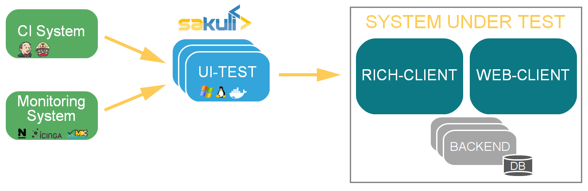
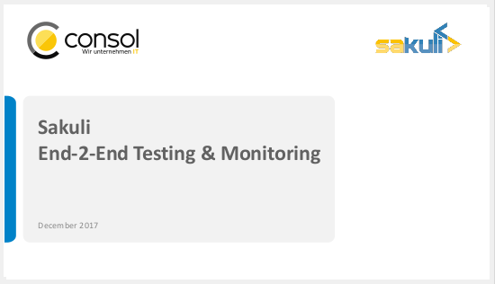

image:./docs/images/sakuli_logo_small.png[sakuli-logo]

:sakuli-latest-version: v1.2.0-SNAPSHOT
:sakuli-doc-base-url: http://consol.github.io/sakuli
:sakuli-doc-url: {sakuli-doc-base-url}/{sakuli-latest-version}

_An end-to-end testing tool for web sites and common UIs with multiple monitoring integrations_

= About the project

*Sakuli simulates user actions* on graphical user interfaces (web, fat client, citrix, …), and provides the obtained information (runtime, result, screenshots) to third party (e.g. Nagios compatible monitoring) systems.

*Sakuli* is written in Java and runs on many platforms:

* {sakuli-doc-url}/#windows[Windows]
* {sakuli-doc-url}/#linux[Linux]
* {sakuli-doc-url}/#containerized-execution[Docker containers]
* MacOS

The *Sakuli* project brings together two Open-Source end-to-end testing tools which perfectly fit together: http://www.sahi.co.in/[Sahi] for *web-based tests* (by injecting JavaScript code into the browser), as well as the screenshot-based testing tool http://sikulix.com/[Sikuli], which allows the execution of *keyboard and mouse actions* on screen areas that have been defined by previously recorded screenshots and are recognized using the OpenCV engine.

= Key Features

* Platform-independent UI testing tool
* End-2-End monitoring of application functionality and quality
* Combines two automation technologies:
** DOM based web testing
** Image pattern based UI automation (for non-web content)
* Scalable from single-client up to multi-node container setup for parallel execution
* Integration of test results into
** Monitoring systems (e.g. Nagios/Icinga)
** CI builds (e.g. Jenkins)

= Documentation
The complete versions of our documentation you can find under:

*{sakuli-doc-base-url}[consol.github.io/sakuli]*

** *_Dev version:_* latest `vX.X.X-SNAPSHOT` version

** *_Stable/Latest version:_* *{sakuli-doc-url}[{sakuli-latest-version}]*

= Quick links

*{sakuli-doc-url}/#download[Download]*

*{sakuli-doc-url}/#examples[Sakuli Examples]*

*{sakuli-doc-url}/#publications[Publications]*

*{sakuli-doc-url}/#events[Events]*

*{sakuli-doc-url}/#media[Media]*

*{sakuli-doc-url}/#changelog[Change Log]*

*{sakuli-doc-url}/#support[Support]*

= Sakuli Short Overview Presentation

[link=./docs/files/Sakuli_Short_Overview.pdf]

