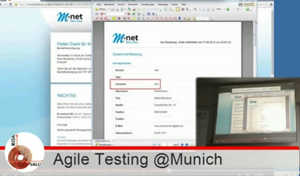

|branch  |build state|docs state| docker images state
|--------|-----------|-----------|-----------|
| `master` |  |  | `consol/sakuli-ubuntu-xfce`       `consol/sakuli-centos-xfce`   
| `dev` |  |   | `consol/sakuli-ubuntu-xfce:dev`       `consol/sakuli-centos-xfce:dev`   

*An end-to-end testing tool for web sites and common UIs with full Nagios integration*

**-> [Download](http://labs.consol.de/sakuli/install/)**

**TABLE OF CONTENTS**

* [**Introduction**](#Introduction)
    * [Concept of Sakuli](#concept-of-sakuli)
    * [History](#history-of-sakuli)
    * [Why Sakuli](#why-sakuli)
* [**Resources**](#resources)
    * [**Documentation**](./docs/index.md)
    * [**Docker Images**](./docs/docker-containers.md)
    * [Exampel projects](#example-projects-on-github)
    * [Demo](#demo-virtual-machine)
    * [Media](#media)
    * [Events](#events)
    * [Changelog](#changelog)
    * [Help](#help)
    * [Thanks](#thanks)

# Introduction
## Concept of Sakuli

**Sakuli simulates user actions** on graphical user interfaces (web, fat client, citrix, …), and provides the obtained information (runtime, result, screenshots) to third party (e.g. Nagios compatible monitoring) systems.

**Sakuli** depends on **Java** and should run on most OS; **Windows**, **Ubuntu  Linux (14.04 LTS)** and **OpenSUSE 13.2** are currently proved.  

The **Sakuli** project brings together two Open-Source end-to-end testing tools which perfectly fit together: **Sahi** ([http://www.sahi.co.in/]([http://www.sahi.co.in/)) for **web-based tests** (by injecting JavaScript code into the browser), as well as the screenshot-based testing tool **Sikuli** ([http://sikulix.com/](http://sikulix.com/)), which allows the execution of **keyboard and mouse actions** on screen areas that have been defined by previously recorded screenshots and are recognized using the OpenCV engine.

Sakuli accesses both tools via its **Java API** and makes it possible to **use them simultaneously**. For example, web tests can be done very performant with Sahi (where a screenshot-based approach would be at best the second choice), whereas "off-DOM"-content can be catched with Sikuli. Whenever a web test comes into a situation which Sahi can't handle (e.g. a PIN dialogue for a smartcard login), use a Sikuli command. On the other hand, pure tests of fat client applications can be easily be setup by using only the Sikuli functions of Sakuli.

## History of Sakuli
First we only wanted to have the possibility to integrate Sahi web tests into Nagios. This was done with a simple VBscript wrapper (thus, only Windows...), which called Sahi with the correct parameters, and sent the results to Nagios via [NSCA](http://exchange.nagios.org/directory/Addons/Passive-Checks/NSCA--2D-Nagios-Service-Check-Acceptor/details). This brought Sahi tests into the well-known format of OK/WARNING/CRITICAL states in Nagios, including performance data of the test runtimes, which could be feeded into PNP4Nagios.

But soon it became clear that there is more than only "web content" to test. Flash and Java Applets for example are content which appear in the Document Object Model ([DOM](http://de.wikipedia.org/wiki/Document_Object_Model)) as a "black box", which can't be accessed by any web testing tool.

So we have looked around for a tool with a totally different approach to "remote control" the user interface: not by its content (like Sahi does with DOM), but by its appearance on the screen. **Sikuli** bridges this gap perfectly: it is able to control (click, type etc...) **everything the user can do on the screen**.

To have a Java application that uses the API of both tools on the one hand, and which uses a modern scripting language for the test definitions itself on the other hand (JavaScript), was the motivation to write Sakuli.

To avoid misunderstandings: "Sakuli" is a portmanteau, formed from the names of the tools "*Sahi*" and "*Sikuli*". Whenever we speak of "**Sakuli**", we are talking about everything that is written about these both tools.  

## Why Sakuli?
There are already a variety of free end2end/automation tools on the market (Sahi, Selenium, WebInject, Sikuli, CasperJS, AutoIT , ...) , but - especially from the perspective of Nagios-based monitoring - each of them has at least one of the following drawbacks:

* **Too specifically**: *pure* web testing tools can only deeal with *pure* web content. Applets, Flash, dialogues generated by OS/browser dialogues etc. are invisible and a insurmountable hurdle for such tools.
*** Too generic**: screen-based testing tools "see" everything the user sees. They are the best choice for GUI tests, but inappropriate for web tests, because each browser type has its own understanding of how to render and display a web page.
* **Far from reality**: There are tools to test web applications on protocol level - but to know whether a web application is working or not requires a test from the user's perspective.
* **Unflexible**: Hardly one of these tools brings the ability to integrate into other systems (like Nagios).

# Resources

## Example projects on GitHub
 * **[toschneck/sakuli-example-bakery-testing](https://github.com/toschneck/sakuli-example-bakery-testing)**
 * **[ConSol/sakuli-example-testautomation-day](https://github.com/ConSol/sakuli-example-testautomation-day)**

## Demo virtual machine

Use this demo appliance to see all the features of Sakuli in action. *sakulidemo* contains OMD/Nagios with two Sakuli checks.  

* **sakulidemo.ova v0.2**: Download the .ova file from [http://labs.consol.de/sakuli/demo](http://labs.consol.de/sakuli/demo) and import this machine into Virtualbox.

User accounts: *root/root* and *sakuli/sakuli*.

It is recommended to fix the VM's resolution to 1024x768px for this demo. In general Sakuli does not relies on any resolution limitation.

Don't use this in production.

## Media

### YouTube

#### Monitoring Minutes

Episode 9 of the ***ConSol Monitoring Minutes*** shows the main features of Sakuli in 15 minutes. The machine used in this video is an instance of our demo appliance (see above).   

[End2End Monitoring mit Sakuli und Nagios - ConSol Monitoring Minutes 9](https://www.youtube.com/watch?v=S6NROEOYF6w)

#### End-2-End-Testing

[Sakuli End-2-End-Testing - Lightning Talk - Agile Testing Meetup (June 2015)](https://www.youtube.com/watch?v=JjRGlkN8BKo)

### Slides

2016: [Containerized End-2-End-Testing - ContainerDays 2016 Hamburg](https://speakerdeck.com/toschneck/containerized-end-2-end-testing-containerdays-2016-in-hamburg) (Tobias Schneck)

2014: [End-to-end testing
for web sites and common UIs with full Nagios integration](https://rawgit.com/toschneck/presentation/sakuli-dev-day-presentation/index.html#/) (Tobias Schneck)

## Publications
8/2016: [heise Devloper: Testautomatisierung in Zeiten von Continuous Delivery](http://www.heise.de/developer/artikel/Testautomatisierung-in-Zeiten-von-Continuous-Delivery-3300566.html) (Christoph Deppisch / Tobias Schneck)

8/2016: [Pressemitteilung:
Testautomatisierung darf nicht bei Unit-Tests Halt machen ](https://www.consol.de/it-services/news/details/testautomatisierung-darf-nicht-bei-unit-tests-halt-machen-1/)

2/2016: [Success Story: pbb Deutsche Pfandbriefbank: Monitoring with Sakuli](https://www.consol.com/fileadmin/pdf/news/success_stories/ConSol_SuccessStory_Monitoring-Sakuli_Pfandbriefbank_eng.pdf)

2/2016: [IT Administrator](http://www.it-administrator.de): ["Den Anwender simuliert"](http://shop.heinemann-verlag.de/it-administrator/einzelhefte/139/ausgabe-februar-2016-it-support-und-troubleshooting) (Simon Meggle)

5/2015: [heise Developer: End-to-End Application Monitoring mit Sakuli](http://www.heise.de/developer/meldung/End-to-End-Application-Monitoring-mit-Sakuli-2729493.html)

2/2015: [IT Administrator](http://www.it-administrator.de): [End2End-Monitoring mit dem Open Source-Tool Sakuli](http://www.it-administrator.de/themen/netzwerkmanagement/fachartikel/179023.html) (Simon Meggle)

## Events

30 January - 3 February, 2017: [OOP 2017, Munich](http://www.oop-konferenz.de/) (Tobias Schneck)

---

November 16, 2016: [ContainerConf 2016, Mannheim](http://www.containerconf.de/) (Tobias Schneck)

November 3, 2016: [Software QS-Tag 2016, Nuremberg](https://www.qs-tag.de) (Tobias Schneck)

September 30, 2016: [JUG Saxony Day, Dresden](http://www.jug-saxony-day.org/) (Tobias Schneck)

August 31, 2016: [Herbstcampus 2016, Nuremberg](http://www.herbstcampus.de/programm.php) (Tobias Schneck)

July 25, 2016: [JUG München](http://www.jugm.de/) (Tobias Schneck)

June 27, 2016 [Meetup during the ContainerDays, Hamburg](http://www.meetup.com/de-DE/Docker-Hamburg/events/229808506) (Tobias Schneck)

March 8-10, 2016: [JavaLand, Brühl](http://www.javaland.eu/de/home/) (Tobias Schneck)

March 3, 2016: [Allianz Arena München](https://www.consol.de/von-monitoring-bis-managed-service/) (Simon Meggle)

March 1, 2016: [Icinga Camp, Berlin](https://www.icinga.org/community/events/icinga-camp-berlin/) (Simon Meggle)

January 26, 2016: [Linux-Stamtisch München](https://www.xing.com/communities/groups/linux-stammtisch-muenchen-1057878) (Tobias Schneck)

---

October 24, 2015: [Ubucon Berlin](http://ubucon.de/2015/) (Simon Meggle)

October 13, 2015: [Testing & Integration Day, Allianz Arena Munich](https://www.consol.de/testing-integration-day-mit-redhat/) (Tobias Schneck)

June 22, 2015: [Agile Testing Munich](http://www.meetup.com/de-DE/Agile-Testing-Munich/events/222659146/?eventId=222659146) (Tobias Schneck)

May 14, 2015: [OpenTechSummit](http://2015.opentechsummit.net/) (Simon Meggle)

March 28, 2015: [LinuxTag Augsburg](https://www.luga.de/Aktionen/LIT-2015/) (Simon Meggle)

## Changelog

[Change Log](changelog.md)

## Help
In case you have any questions or requests for help, feel free to get in contact with us!
The Sakuli team members are reachable on the email address **[sakuli@consol.de](mailto:sakuli@consol.de)**.

The guys behind Sakuli:

<table>
<tr>
<td>
**ConSol Software GmbH**  
*Franziskanerstr. 38, D-81669 München*  
*Tel. +49-89-45841-100, Fax +49-89-45841-111* 
*Homepage: http://www.consol.de E-Mail: [info@consol.de](info@consol.de)*
</td>
</tr>
<table>

## Thanks

### Contributors

At this point we want to thank all contributors, which helped to move this great project by submitting code, writing documentation, or adapting other tools to play well together with Sakuli.

* Tobias Schneck - Sakuli Team / Project Leader, Core Development
* Simon Meggle - Sakuli Team / Project Leader, Monitoring Integration
* Christoph Deppisch - Sakuli Team / Core Development
* Lukas Höfer - Sakuli Team / Consultant
* Sven Nierlein
* Philip Griesbacher - Sakuli Go Starter
* Thomas Rothenbacher

(did we forget you? Please poke us):

### Valued supporters

Very special thanks to all customers which always nourish this project with new ideas and impulses and make it possible in the first place to give it back to the community as Open Source Software. Thumbs up!

* LIDL Stiftung & Co. KG
* Deutsche Pfandbriefbank AG
