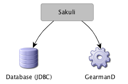
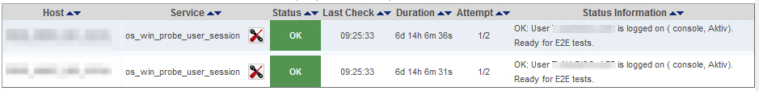

# Additional settings

This page contains different topics regarding the configuration of both **Sakuli** and its components, **Sahi** and **Sikuli**.

The default settings in `__SAKULI_HOME__/_include/sakuli.properties` can be overridden for each test in the property file `__SAKULI_HOME__/_sakuli_test_suites/__SUITE__/testsuite.properties`. 

For example, you can set `testsuite.browser=firefox` in `sakuli.properties` to execute each test in Firefox. If one check should run in IE, set `testsuite.browser=ie` in `testsuite.properties`. 


## Sakuli settings

### Receivers

<!--- FIXME: umbenennen in forwarder -->

Sakuli can send test result to "Receivers", which can be currently **GearmanD** servers (such as Nagios monitoring systems with mod-gearman) and **JDBC databases**. If no receiver is defined, a result summary is printed out in the end of a suite. 
  


For the configuration of receivers on the OMD server side, see [Receivers in OMD](installation-omd.md#receivers)

Depending on your environment, you probably want to set up one of these two possible receiver types. 

  * [Setting up Sakuli client to send results to the **Database**](receiver-database.md#sakuli-configuration)
  * [Setting up Sakuli client to submit results to the **Gearman Receiver**](receiver-gearman.md#sakuli-configuration)


### Logging 

#### Verbosity

Logging verbosity can be defined **globally** as well as on a **per-suite** basis. In addition, it is possible to control the logging verbosity of all compoments *Sakuli, Sahi, Sikuli, Spring* - and *Java* in general. 

("Verbosity" means one of the levels `DEBUG - INFO - WARN - ERROR` )

* setting **globally**: `__SAKULI_HOME__/_include/sakuli-log-config.xml`

        <logger name="org.sakuli" level="${log-level-sakuli:-INFO}"/>
        <logger name="org.sikuli" level="${log-level-sikuli:-WARN}"/>
        <logger name="net.sf.sahi" level="${log-level-sahi:-WARN}"/>
        <logger name="org.springframework" level="${log-level-spring:-WARN}"/>
        <root level="${log-level-root:-INFO}">
            <appender-ref ref="stdout"/>
            <appender-ref ref="sakuli"/>
        </root>

    Each component is bound to a "**logger**". Its verbosity value is in UPPERCASE letters at the end of each line (e.g. `INFO`), or gets overriden with a custom variable, if set (see next point).

* setting **per check** in the starter scripts in `__SAKULI_HOME__/scripts/starter/` by appending **debug variables** on the call of *SakuliStarter* :

    * `-Dlog-level-sakuli=__LEVEL__`  -  logging level for **Sakuli** output
    * `-Dlog-level-sikuli=__LEVEL__`  -  logging level for **Sikuli** output
    * `-Dlog-level-sahi=__LEVEL__`  -  logging level for **Sahi** output
    * `-Dlog-level-spring=__LEVEL__`  -  logging level for the **Spring** framework (only used internally)
    * `-Dlog-level-root=__LEVEL__`  -  logging level for all other **Java classes and libraries**

    Example: To override the log level for **Sakuli** (default: `ÌNFO`) with `WARN`: 

        java -classpath ... org.sakuli.starter.SakuliStarter -run "$SAKULI_HOME/sakuli_test_suites/$SUITE" "$INCLUDE_FOLDER" -Dlog-level-sakuli=WARN

For more information about the Logback syntax please refer to the [Logback manual](http://logback.qos.ch/manual/configuration.html).	 

#### Log file location / format

Edit `__SAKULI_HOME__/_include/sakuli.properties` to configure the logfile format and its location: 

		sakuli.log.pattern= %-5level [%d{YYYY-MM-dd HH:mm:ss.SSS}] - %msg%n
		sakuli.log.folder=${sakuli.testsuite.folder}/_logs


### Secret De-/Encryption
#### Interface selection

Neither Sahi nor Sikuli have a way to prevent **sensible data** (passwords, PINs, etc.) from being logged and stored in the script in **clear text**. 

That's the reason why Sakuli is able to **encrypt** them on the command line, and to **decrypt** them again on runtime just for the moment when they are needed. There is no (quick) way to decrypt those secrets again on the command line, so this is rather a way to obscure things not everybody should see than high-secure a encryption mechanism. 

Among other parameters, Sakuli uses the MAC address of a local network interface card as a encryption salt. Hence no virtual adapters can be choosen. 

In `__SAKULI_HOME__/_include/sakuli.properties` you can let Sakuli automatically select an adapter:

	# automatically select the first NIC for secret encryption
    sakuli.encryption.interface.autodetect=true`

Alternatively specify one:

    # use NIC eth0 for secret encryption
    sakuli.encryption.interface.autodetect=false`
	sakuli.encryption.interface=eth0 

Like all other properties, this can also be set for each test suite in `testsuite.properties`.

#### Encrypt a secret

On **Windows**, open `cmd.exe` and execute the following command:  

    # for autodetect=true
    %SAKULI_HOME%\scripts\helper\encrypt_password.bat somesecret [enter]
      String to Encrypt: somesecret
      ...
      Encrypted secret with interface 'eth3': THwLJK7ObjLkmoViCHm7lA==
      
    # for autodetect=false
    %SAKULI_HOME%\scripts\helper\encrypt_password.bat somesecret eth8 [enter] 
      String to Encrypt: somesecret
      ...
      Encrypted secret with interface 'eth8': bVKIUWcgaPDjasFf2uI15Q==

On the **Linux** `shell` it's almost the same: 

    # for autodetect=true
    %SAKULI_HOME%/scripts/helper/encrypt_password.sh somesecret [enter]

    # for autodetect=false
    %SAKULI_HOME%/scripts/helper/encrypt_password.sh somesecret eth8 [enter] 

#### Decrypt a secret

To decrypt and use a secret in Sakuli test cases, use one of the following methods:

* [pasteAndDecrypt](./api/sakuli_Environment.md#pasteanddecrypttext)
* [typeAndDecrypt](./api/sakuli_Environment.md#typeanddecrypttext-optmodifiers)
* [decryptSecret](./api/sakuli_Environment.md#decryptsecretsecret)


### Screenshot settings

`%SAKULI_HOME%/_include/sakuli.properties` allows to set the format and destination folder for screenshots taken by Sakuli:

    # folder for screenshot files (if activated)
    sakuli.screenshot.dir=${sakuli.log.folder}/_screenshots

    # screenshot file format (Possible values: jpg, png)
    sakuli.screenshot.format=jpg
    

### RDP pecularities
#### connection types
There are several ways to connect to and work on a Sakuli client machine:

1. **VNC**
2. **Console** of a virtualization platform (ESX, Virtualbox, etc.)
3. **Remote Desktop**
4. **local screen** 

For case 1. and 2. there is nothing special to watch out for, except that the screen must not be locked (see the [installation manual](../docs/installation-windows.md)). The screen content will be the same as displays on the local screen (4.). 

For RDP, there are some special things to know. Connecting to the Sakuli test client via RDP **locks any existing local console session of that user** and **attaches (="moves") it to a RDP session**.

Sakuli will also run within that RDP session. But closing/disconnecting/logging of that RDP session will not unlock the local console session again. Sakuli will see the same as a regular user: the famous blue lock screen.

#### LOGOFF.bat
To log off a RDP session, right-click `%SAKULI_HOME%/scripts/helper/LOGOFF.bat` and execute the script with administrator privileges. 

* determine the current RDP session ID
* redirect this session back to the local console
* terminate the RDP session.

#### check_logon_session.ps1

In *sakuli\setup\nagios* you can find **check_logon_session.ps1** which can be used as a client-side check to ensure that the Sakuli user is always logged on, either via RDP or on the local console. Instructions for the implementation of this check can be found in the script header.

Define a service dependency of all Sakuli checks to this logon check; this will ensure that a locked session will not raise false alarms.



## Sahi settings
### Adding browsers to Sahi
If the Sahi dashboard does not show any browser or if you want to add another browser to the dashboard…

 

…you have to edit `__SAKULI_HOME__\sahi\userdata\config\browser_types.xml`. Each browser is defined within a **browserType** block. Please refer to the [Sahi Documentation, "Configure Browsers"](https://sahipro.com/docs/using-sahi/sahi-configuration-basic.html) to see the *browserType* Nodes for popular browsers. 

For **PhantomJS** please save [sahi.js](http://labs.consol.de/sakuli/install/3rd-party/phantom/sahi.js) into the folder `__SAKULI_HOME__\phantomjs\` and use this option line: 

        	<options>--proxy=localhost:9999 __SAKULI_HOME__\phantomjs\sahi.js</options> 
	

### Sahi behind a proxy
If web tests with Sakuli should go through your company's proxy, edit the property file `__SAKULI_HOME__/_include/sakuli.properties` and set it there for both http and https. `auth.username` and `auth.password` are only used if `auth.enable` is set to `true`.

Use the bypass list to exclude certain URLs from being accessed through the proxy.

    ```
	### HTTP/HTTPS proxy Settings
	### Set these properties, to enable the test execution behind company proxies
	# Use external proxy server for HTTP
	ext.http.proxy.enable=true
	ext.http.proxy.host=proxy.yourcompany.com
	ext.http.proxy.port=8080
	ext.http.proxy.auth.enable=false
	ext.http.proxy.auth.name=user
	ext.http.proxy.auth.password=password

	# Use external proxy server for HTTPS
	ext.https.proxy.enable=true
	ext.https.proxy.host=proxy.server.com
	ext.https.proxy.port=8080
	ext.https.proxy.auth.enable=false
	ext.https.proxy.auth.name=user
	ext.https.proxy.auth.password=password

	# There is only one bypass list for both secure and insecure.
	ext.http.both.proxy.bypass_hosts=localhost|127.0.0.1|*.internaldomain.com|www.verisign.com

    ```


<!--- FIXME killprocs.vbs/.sh -->
