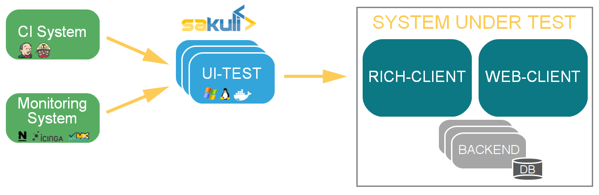
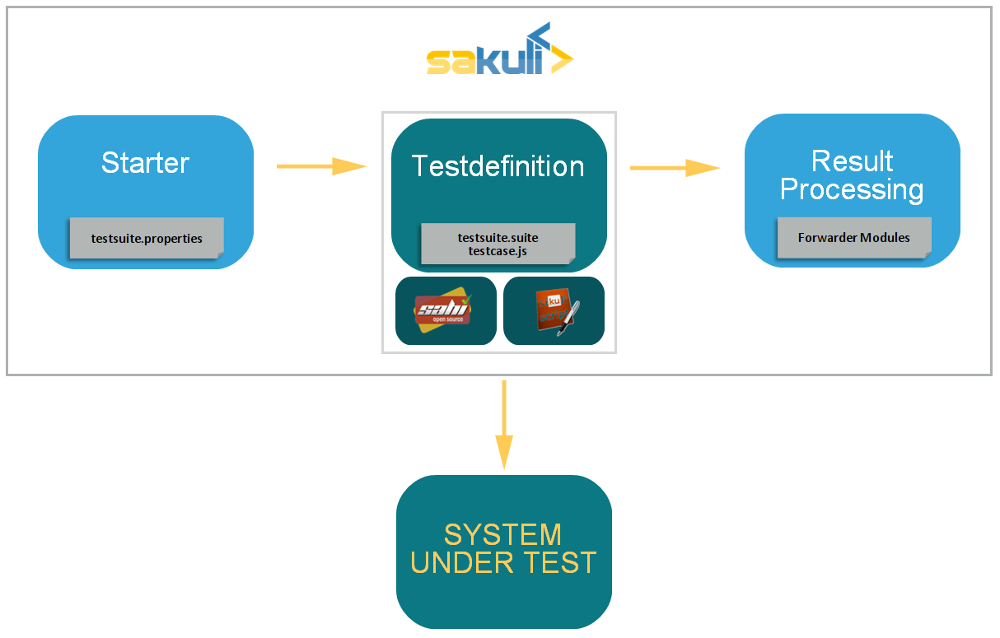

[[concept]]
== Concept

TODO aktualisieren und abstrachieren, https://jaxenter.de/sakuli-testing-monitoring-container-54374[https://jaxenter.de/sakuli-testing-monitoring-container-54374]

TODO Grobes Kontzept danach tiefere Themen wie Detail-Testdefiniton verlinken

TODO Liste der Forwarder hinzufügen

*Sakuli simulates user actions* on graphical user interfaces (web, fat client, citrix, …), and provides the obtained information (runtime, result, screenshots) to third party (e.g. Nagios compatible monitoring) systems.

*Sakuli* depends on *Java* and should run on most OS; *Windows*, *Ubuntu Linux (14.04 LTS)* and *OpenSUSE 13.2* are currently proved. 

The *Sakuli* project brings together two Open-Source end-to-end testing tools which perfectly fit together: *Sahi* ([http://www.sahi.co.in/[http://www.sahi.co.in/]) for *web-based tests* (by injecting JavaScript code into the browser), as well as the screenshot-based testing tool *Sikuli* (http://sikulix.com/[http://sikulix.com/]), which allows the execution of *keyboard and mouse actions* on screen areas that have been defined by previously recorded screenshots and are recognized using the OpenCV engine.

Sakuli accesses both tools via its *Java API* and makes it possible to *use them simultaneously*. For example, web tests can be done very performant with Sahi (where a screenshot-based approach would be at best the second choice), whereas "off-DOM"-content can be catched with Sikuli. Whenever a web test comes into a situation which Sahi can't handle (e.g. a PIN dialogue for a smartcard login), use a Sikuli command. On the other hand, pure tests of fat client applications can be easily be setup by using only the Sikuli functions of Sakuli.

