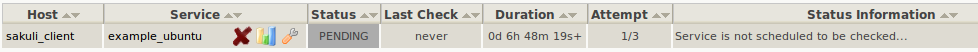

# Gearman Forwarder
This page describes how Sakuli can be configured to transmit its test results directly into the **Gearman queue** of the monitoring system. 

* Receiving Nagios **host**: property `sakuli.forwarder.gearman.nagios.hostname` (define globally or per suite)
* Receiving Nagios **service**: property `testsuite.id` in `testsuite.properties` 

## OMD Configuration

### Enable the site's mod-gearman server

Stop the OMD site:

	OMD[sakuli]:~$ omd stop

Start the OMD configuration menu

	OMD[sakuli]:~$ omd config
	
Select *Distributed Monitoring* and

* -> `GEARMAND` -> `ON` 
* -> `GEARMAND_PORT` -> `__OMD_IP__:__GEARMAN_PORT__` (default: 4730) 
* -> `GEARMAN_NEB` -> `ON` 
* -> `GEARMAN_WORKER` -> `OFF` # only if workers aren't still used
* -> `MOD_GEARMAN` -> `ON` 

As Sakuli only uses the *result queue* of gearmand, you can disable all other queues unless you are using mod-gearman for regular checks: 

    OMD[sakuli]:~$ vim ~/etc/mod-gearman/server.cfg
	eventhandler=no
	services=no
	hosts=no
	do_hostchecks=no
	
At the time of the creation of this documents, Sakuli does not encrypt any gearman results. Therefore, set  `accept_clear_results` in `server.cfg`:

    OMD[sakuli]:~$ vim ~/etc/mod-gearman/server.cfg
	accept_clear_results=yes
	
Restart OMD: 

    OMD[sakuli]:~$ omd start
	  
### Create a Nagios service

Create a check_command, which will be executed only if Nagios did not receive a Sakuli result within the last 30 minutes. This ensures that you get a notification even if no passive check results arrive in Nagios at all:   

	vim ~/etc/nagios/conf.d/commands.cfg
	
	define command {
	  command_name                   check_dummy
	  command_line                   $USER1$/check_dummy $ARG1$ $ARG2$
	}

Create a host object for the host on which Sakuli checks will be executed: 

	vim ~/etc/nagios/conf.d/hosts.cfg
	
	define host {
	  host_name                      sakuli_client
	  alias                          Sakuli Client
	  address                        [IP]
	  use                            generic-host
	}

Create the following service object for the first test case (set the service name depending on your client's OS!): 

	vim ~/etc/nagios/conf.d/services.cfg
	
	define service {
	  # service_description            example_windows
	  # service_description            example_opensuse
	  service_description            example_ubuntu
	  host_name                      sakuli_client
	  use                            generic-service,srv-pnp
	  active_checks_enabled          0
	  check_command                  check_dummy!3!'Did not receive any Sakuli result within 30 minutes.'
	  check_freshness                1
	  freshness_threshold            1800
	  passive_checks_enabled         1
	}
	
Reload OMD:

	omd reload
	
Now open Thruk; you should see now the Sakuli host with one service attached: 

 

The check is waiting now for check results from Sakuli clients. 

## Sakuli Configuration
Open `__SAKULI_HOME__\_include\sakuli.properties` on the Sakuli client: 

### Gearman parameters

	sakuli.forwarder.gearman.enabled=true
	sakuli.forwarder.gearman.server.host=__GEARMAN_IP__
	sakuli.forwarder.gearman.server.port=[Gearman Port defined in "omd config" (default:4730)]
	sakuli.forwarder.gearman.server.queue=check_results
	
	# Nagios check settings
	# default nagios host_name (can be overwritten in testsuite.properties) 
	sakuli.forwarder.gearman.nagios.hostname=sakuli_client
	# gets appended to the performance data in order to set the name of PNP4nagios template
	sakuli.forwarder.gearman.nagios.check_command=check_sakuli

## Test

Now execute the example test case again; the service should change its status then: 

 

 

