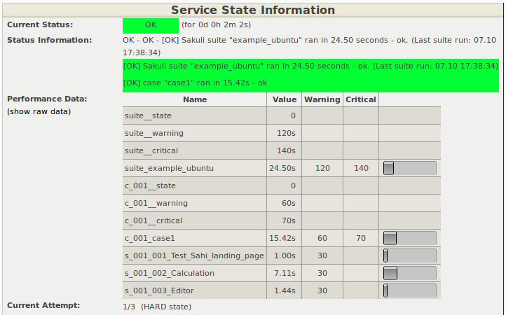

# Gearman Forwarder
This page describes how the results of the Sakuli tests **example_windows7/ubuntu/opensuse** can be transmitted directly into the **Gearman result queue** of the monitoring system. 


* Nagios **host**: property `sakuli.forwarder.gearman.nagios.hostname` (define globally or per suite)
* Nagios **service**: property `testsuite.id` in `testsuite.properties` 

## OMD Configuration

### Enable the site's mod-gearman server

Stop the OMD site:

	OMD[sakuli]:~$ omd stop

Start the OMD configuration menu

	OMD[sakuli]:~$ omd config
	
Select *Distributed Monitoring* and

* -> `GEARMAND` -> `ON` 
* -> `GEARMAND_PORT` -> `__OMD_IP__:__GEARMAN_PORT__` (default: 4730) 
* -> `GEARMAN_NEB` -> `ON` 
* -> `GEARMAN_WORKER` -> `OFF` # only if workers aren't still used
* -> `MOD_GEARMAN` -> `ON` 

As Sakuli only uses the *result queue* of gearmand, you can disable all other queues unless you are using mod-gearman for regular checks: 

    OMD[sakuli]:~$ vim ~/etc/mod-gearman/server.cfg
	eventhandler=no
	services=no
	hosts=no
	do_hostchecks=no
	
At the time of the creation of this documents, Sakuli does not encrypt any gearman results. Therefore, set  `accept_clear_results` in `server.cfg`:

    OMD[sakuli]:~$ vim ~/etc/mod-gearman/server.cfg
	accept_clear_results=yes
	
Restart OMD: 

    OMD[sakuli]:~$ omd start
	  
### Create a Nagios service

Create a check_command, which will be executed only if Nagios did not receive a Sakuli result within the last 30 minutes. This ensures that you get a notification even if no passive check results arrive in Nagios at all:   

	vim ~/etc/nagios/conf.d/commands.cfg
	
	define command {
	  command_name                   check_dummy
	  command_line                   $USER1$/check_dummy $ARG1$ $ARG2$
	}


Create a host object for the Sakuli client: 

    OMD[sakuli]:~$ vim etc/nagios/conf.d/hosts.cfg
	
	define host {
	  host_name                      sakuli_client
	  alias                          Sakuli Client
	  address                        [IP]
	  use                            generic-host
	}

Create the following service object for the first test case. *freshness_threshold* should be slightly higher than the interval Sakuli tests are planned (see also [RRD heartbeat](installation-omd.md#rrd-heartbeat) )

	vim ~/etc/nagios/conf.d/services.cfg

    OMD[sakuli]:~$ vim etc/nagios/conf.d/services.cfg

	define service {
	  # service_description            example_windows7
	  # service_description            example_opensuse
	  service_description            example_ubuntu
	  host_name                      sakuli_client
	  use                            generic-service,srv-pnp
	  active_checks_enabled          0
	  check_command                  check_dummy!3!'Did not receive any Sakuli result within 3 minutes.'
	  check_freshness                1
	  freshness_threshold            180
	  passive_checks_enabled         1
	}
	
Reload OMD:

	omd reload
	
Now open Thruk; you should see now the Sakuli host with one service attached: 

 

The check is waiting now for check results from a Sakuli client. 

### Adapt perfdata spooling

By default, the timestamp on which perfdata are getting stored in RRDTOOL comes from *service_perfdata_template*, which can be found in `~/etc/nagios/nagios.d/pnp4nagios.cfg`: 

    service_perfdata_file_template=DATATYPE::SERVICEPERFDATA\tTIMET::$TIMET$\tHOSTNAME::$HOSTNAME$ ... ...

Using the [Nagios macro](https://assets.nagios.com/downloads/nagioscore/docs/nagioscore/3/en/macrolist.html#timet) `$TIMET$` (= current timestamp) as the perfdata time is absolutely ok as long as there is no network outage between the Sakuli client and OMD. But if Sakuli cannot send the result to gearmand, it appends the result to `.gearman_cache` within the Suite folder and tries to send first the cached results before the current result.

With the template above, cached check results would get false (=current) timestamp. To prevent this, replace `$TIMET$` by `$LASTSERVICECHECK$`. 

    service_perfdata_file_template=DATATYPE::SERVICEPERFDATA\tTIMET::$LASTSERVICECHECK$\tHOSTNAME::$HOSTNAME$ ... ...

Now, the performance data of a cached check result like this one in `.gearman_cache`

```
======= check_results:sakuli_ubuntu__2016_03_24_12_34_08_716
type=passive
host_name=sakuli_client
start_time=1458800000.000
finish_time=1458822225.000
return_code=0
service_description=sakuli_ubuntu
output=[OK] Cache-result 5 | foobar=112;333;444;;
=======
```
will get stored in RRD correclty with the timestamp of "start_time" = 1458800000. 


## Sakuli gearman forwarder configuration

On the Sakuli client you must set the global properties for the gearman receiver. For this, edit `sakuli.properties` in the folder containing the test suites (you can copy the lines from `__SAKULI_HOME__/conf/sakuli-default.properties`):. 

    __INST_DIR__/example_test_suites/sakuli.properties:

	sakuli.forwarder.gearman.enabled=true
	sakuli.forwarder.gearman.server.host=__GEARMAN_IP__
	sakuli.forwarder.gearman.server.port=[Gearman Port defined in "omd config" (default:4730)]
	sakuli.forwarder.gearman.server.queue=check_results
	
	sakuli.forwarder.gearman.cache.enabled=true
	sakuli.forwarder.gearman.job.interval=1000
	
	# Nagios host where all Sakuli services are defined on. If neccessary, override this value per test suite. 
    # (Nagios service name is defined by testsuite.properties -> suiteID)
	sakuli.forwarder.gearman.nagios.hostname=sakuli_client
	sakuli.forwarder.gearman.nagios.check_command=check_sakuli

## Test result transmission to OMD

Execute the example test case again:

* **Ubuntu**: `sakuli run __INST_DIR__/example_test_suites/example_ubuntu/` 
* **openSUSE**: `sakuli run __INST_DIR__/example_test_suites/example_opensuse/` 
* **Windows7**: `sakuli run __INST_DIR__\example_test_suites\example_windows7\`
* **Windows8**: `sakuli run __INST_DIR__\example_test_suites\example_windows8\`

The service should change its status to:

 


 


## Screenshot history (optional)

Since Sakuli v1.1.0, exception messages containing a screenshot also provide a CSS based magnifier/lightbox option to enlarge the currently displayed image. This perfect if you can live with the fact that a screenshot is only visible for the time until the next result arrives - which will update the service output and the embedded image. 

It is also possible to view a screenshot history. (This has been tested in OMD; for other monitoring systems you might have to adapt the SSI.)

Each Sakuli check is combined with an event handler script, which saves the base64 encoded image to the local file system if the result is CRITICAL and the output contains the pattern "EXCEPTION". The monitoring web frontend (in OMD: Thruk) then can load these images into a lightbox. 

### configure event handler (OMD system)

Copy the event handler script to the local plugin directory

    OMD[sakuli]:~$ cp __TEMP__/sakuli-vx.x.x-SNAPSHOT/setup/nagios/screenshot_lightbox/eh_sakuli_screenshot.sh ~/local/lib/nagios/plugins/
    
and define a command: 

    vim ~/etc/nagios/conf.d/commands.cfg
    
    define command {
        command_name                   eh_sakuli_screenshot
        command_line                   $USER2$/eh_sakuli_screenshot.sh $SERVICESTATE$ $HOSTNAME$ $SERVICEDESC$ $LASTSERVICECHECK$
    }  
    
The eventhandler script also deletes screenshots older than 30 days. If you want to override this, define the number of days to keep screenshots as a custom macro (e.g. `$USER12`) and use this variable as fifth parameter: 

        command_line                   $USER2$/eh_sakuli_screenshot.sh $SERVICESTATE$ $HOSTNAME$ $SERVICEDESC$ $LASTSERVICECHECK$ $USER12$

Now connect the event handler command to every Sakuli service: 

    define service {
        service_description            sakuli_ubuntu
        host_name                      sakuli_client
        use                            generic-service,srv-pnp
        ...
        ...
        event_handler                  eh_sakuli_screenshot
    }

Reload the monitoring core. 

### screenshot directory

Create the screenshot directory: 

    OMD[sakuli]:~$ mkdir -p ${OMD_ROOT}/var/sakuli/screenshots

Install the Apache configuration file:  

    OMD[sakuli]:~$ cp __TEMP__/sakuli-vx.x.x-SNAPSHOT/setup/nagios/screenshot_lightbox/sakuli_screenshots.conf ~/etc/apache/conf.d/sakuli_screenshots.conf
 
### Thruk SSI 

SSI (Server Side Include) is a technique to include additional code delivered by the web server. You have to extend Thruks SSI files with some HTML/CSS/JS, to make the lightbox working. Upcoming versions of Thruk will support custom SSI files, too ([commit](https://github.com/sni/Thruk/commit/1183f28071855a76d43ec49bd60aaba316d7fcb0)).
   
Open `__TEMP__/sakuli-vx.x.x-SNAPSHOT/setup/nagios/screenshot_lightbox/extinfo-header.ssi.add` and follow the instructions how to add the JavaScript/CSS/HTML to `extinfo-header.ssi`.

From now, clicking on a screenshot opens the lightbox which shows the last event. Use the buttons on the bottom right corner or the arrow keys to browse through all previous events; press Esc to close the lightbox again: 


