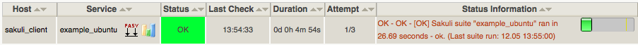

# Icinga2 API Forwarder

This page describes how the results of Sakuli tests can be sent to the [REST API](http://docs.icinga.org/icinga2/snapshot/doc/module/icinga2/chapter/icinga2-api) of an [Icinga2](https://www.icinga.org/) monitoring instance. 

## Icinga2 configuration

### Enable the Icinga2 API

The steps to enable the Icinga2 API are described in the [REST API documentation](http://docs.icinga.org/icinga2/snapshot/doc/module/icinga2/chapter/icinga2-api).

### Create a Icinga2 service

Create a **check_command**, which will be executed only if Icinga did not receive a Sakuli result within the last 30 minutes. This ensures that you get a notification even if no passive check results arrive in Nagios at all:   

	vim /etc/icinga2/conf.d/commands.conf
	
	object CheckCommand "check_dummy" {
       import "plugin-check-command"
       command = [
         PluginDir + "/check_dummy","$dummy_state$","$dummy_text$"
       ]
       vars.dummy_state = 0
       vars.dummy_text = "Check was successful."
    }

    object CheckCommand "check_sakuli" {
       import "check_dummy"
       vars.dummy_state = 3
       vars.dummy_text = "No passive Sakuli check result received."
    }

Create a **host** object for the Sakuli client: 

    vim /etc/icinga2/conf.d/hosts.conf
	
	object Host "sakuliclient01" {
       import "generic-host"
       address = [IP]
    }

Create the following **service** object for the first test case. *freshness_threshold* should be slightly higher than the interval Sakuli tests are planned (see also [RRD heartbeat](installation-omd.md#rrd-heartbeat) )

    object Service "sakuli_demo" {
      import "generic-service"
      host_name = "sakuliclient01"
      check_command = "check_sakuli"
      enable_active_checks = 0
      enable_passive_checks = 1
      enable_flapping = 0
      volatile = 1
      enable_perfdata = 1
    }

Reload Icinga2: 

    service icinga2 reload
       
Now open Icingaweb2; you should see the Sakuli host with the service *"sakuli_demo"* attached: 

 

The check is waiting now for check results from a Sakuli client. 

## Sakuli Icinga2 forwarder parameter

On the Sakuli client you must set the global properties for the Icinga2 receiver. For this, edit `sakuli.properties` in the folder containing the test suites (you can copy the lines from `__SAKULI_HOME__/conf/sakuli-default.properties`):. 

    __INST_DIR__/example_test_suites/sakuli.properties:

	sakuli.forwarder.gearman.enabled=true
	sakuli.forwarder.gearman.server.host=__GEARMAN_IP__
	sakuli.forwarder.gearman.server.port=[Gearman Port defined in "omd config" (default:4730)]
	sakuli.forwarder.gearman.server.queue=check_results
	
	# Nagios host where all Sakuli services are defined on. If neccessary, override this value per test suite. 
    # (Nagios service name is defined by testsuite.properties -> suiteID)
	sakuli.forwarder.gearman.nagios.hostname=sakuli_client
	sakuli.forwarder.gearman.nagios.check_command=check_sakuli

## Test result transmission to OMD

Execute the example test case again:

* **Ubuntu**: `sakuli run __INST_DIR__/example_test_suites/example_ubuntu/` 
* **openSUSE**: `sakuli run __INST_DIR__/example_test_suites/example_opensuse/` 
* **Windows 7**: `sakuli run __INST_DIR__\example_test_suites\example_windows7\`
* **Windows 8**: `sakuli run __INST_DIR__\example_test_suites\example_windows8\`

The service should change its status to:

 

 

