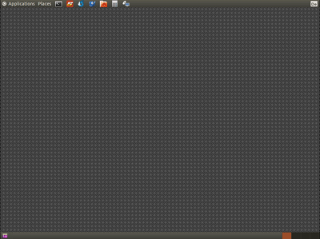

# Headless Sakuli checks on Ubuntu

## Installing and configuring the VNC server

First **install** vnc4server: 

    sudo apt-get install vnc4server
    
Start vncserver for the first time to create a **session password**: 

    ~$ vncserver

    You will require a password to access your desktops.
    Password:
    Verify:

    New 'sakulidemo:1 (sakuli)' desktop is sakulidemo:1

    Creating default startup script /home/sakuli/.vnc/xstartup
    Starting applications specified in /home/sakuli/.vnc/xstartup
    Log file is /home/sakuli/.vnc/sakulidemo:1.log

Edit `.vnc/xstartup`: 

    ~$ vim .vnc/xstartup  
    
        #!/bin/sh
        export XKL_XMODMAP_DISABLE=1
        unset SESSION_MANAGER
        unset DBUS_SESSION_BUS_ADDRESS

        gnome-panel &
        gnome-settings-daemon &
        metacity &

Restart the current vnc sesssion: 

    ~$ killall Xvnc4 && vncserver
    
Now open a RDP client (on Ubuntu: *Applications - Internet - Remmina Remote Desktop Client*) and enter the connection data: 

* Protocol: VNC
* Server: localhost:5901
* Password: `__VNC_SESSION_PASSWORD__`

You should see now a grey empty desktop with only the menu and status bar: 

## Test

You are now ready to run the **minimal Sakuli check** in **headless (=VNC)** mode.

On the **Ubuntu** desktop, open a terminal window and execute 

    `~$ sakuli/scripts/starter/START_example_linux_headless.sh` 
 
You should see that Sakuli

1.  opens **Firefox**
2.  opens the **calculator** and calculates *525+100=625* 
3.  opens an **editor** and writes a **status message**

