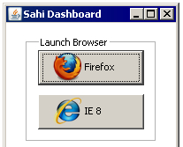
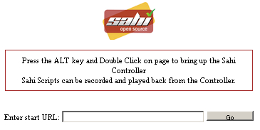
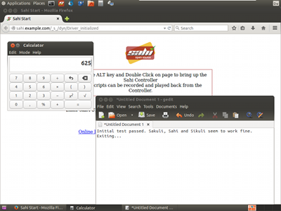

# Sakuli client installation 

This page describes the common steps to **install and test** Sakuli on **Windows** and **Linux** (Ubuntu Desktop 14.04 LTS/GNOME Fallback, OpenSUSE 13.2/KDE). For updating Sakuli, click [here](#upgrade-process).

The default installation path of a particular Sakuli version is referenced as `%SAKULI_HOME%`, that is 

- `%SAKULI_HOME%` on **Windows** (e.g. `C:\sakuli\sakuli-v0.6.0\`)
- `$SAKULI_HOME` on **Linux** (e.g. `/home/e2e/sakuli/sakuli-v0.6.0/`)

**Conventions**: 

- Wherever you see `%SAKULI_HOME%` in the instructions, replace it by the appropriate variable `$SAKULI_HOME` (**Linux**) respectively `%SAKULI_HOME%` (**Windows**).
- Values surrounded by underscores are have to be filled individually by you (e.g. `__IP_ADDRESS__`).
- Unless stated otherwise, slashes/backslashes have to be used depending on the operating system.

## Prerequisites

We recommend to run Sakuli clients on virtual machines.

* **OS**: **Windows** or **Linux** (Ubuntu Desktop 14.04 LTS, OpenSUSE 13.2). 
* **RAM**: 3GB+
* **CPU**: dual-Core
* if virtualized: **Hypervisor guest additions** for best performance 
* no local firewall running
* a user account with **sudo/admin rights**
* desktop appearance:
  * Set the desktop background to a homogenous color. 
  * If you do not want to run Sakuli [headless](headless-linux.md), disable any screen locking mechanisms
  * Sakuli needs a reliable and predictable desktop environment: make sure that there are no pop-up windows of services or applications
  * If Sakuli is running within a VM, change the desktop resolution to a fixed value (e.g. 1024x768) and disable any auto-resizing mechanisms of the guest display. This ensures that the guest's resolution does not change in case that you resize its window.
  * Other optional steps see ["Desktop tuning"](./troubleshooting-tuning-sakuli-client.md#desktop-tuning).
* the client should not have more than one physical screen 

## Software installation 
### Java

Sakuli versions including v0.4.* need **Java JRE 7**; all newer versions are based on **Java JRE 8**.  

Additionally, on **Windows**: 

* From desktop, right-click *My Computer* and click *Properties*
* In *System Properties*, click on *Advanced*
* Edit the **system variable** **%PATH%** and add one of the following paths to the java binary: 
  * Name: `PATH`
  * Value: 
    * `;C:\Program Files\Java\jre7/8\bin`
    * or 
	* `;C:\Program Files (x86)\Java\jre7/8\bin`
	

### Sakuli 

* Download **Sakuli** from  [http://labs.consol.de/sakuli/install](http://labs.consol.de/sakuli/install)
  * current **development** snapshot = `sakuli-v.0.6.0-SNAPSHOT.zip` 
  * current **stable** version = highest version of `sakuli-zipped-release-vX.X.X.zip` 
* Unzip the downloaded archive into a folder of your choice; a folder `sakuli` will be created (referenced as `__INST_DIR__`). 
* Set the environment variable `SAKULI_HOME`: 
  * **Windows**
    * From desktop, right-click *My Computer* and click *Properties*
    * In *System Properties*, click on *Advanced*
  	* Create a new **user variable**: 
        * Name: `SAKULI_HOME`
  	  * Value: `__INST_DIR__\sakuli-vX.X.X\`
  * **Linux**
    * Add to `~/.bashrc`: 
    
      `export SAKULI_HOME=__INST_DIR__/sakuli-vX.X.X/`
      
* Additionally, on **Linux** you have to install `tesseract` (and maybe `wmctrl`) manually: 

        # Ubuntu
        sudo apt-get install tesseract-ocr
        sudo apt-get install wmctrl
        # openSUSE
        sudo zypper install tesseract
        sudo zypper install wmctrl
        
### Sahi

* Download **Sahi** from [http://sourceforge.net/projects/sahi/files/?source=navbar](http://sourceforge.net/projects/sahi/files/)
  * For **Sakuli < v0.6.0**, use version **0.44**
  * For **Sakuli >= v0.6.0**, use version **0.5**
* Unpack the downloaded file and start the installation by executing `java -jar __DOWNLOADED_JAR_FILE__`. In the installation assistant, set: 
  * Installation path: `__INST_DIR__/sahi`
  * select all packages to install

Sahi can be tested now for the first time. Open *"Start Sahi"* from the applications menu of your OS. 

The **Sahi Dashboard** should now list all available browsers on this system. To use the minimal test cases (see below), we recommend to install Firefox, if not yet done. (see [Browser configuration](./additional-settings.md#browser-configuration)): 

 
 
 
	
After clicking on a browser icon you should see the default start page of Sahi: 

 

If neccessary, set the proxy Sahi is behind of: [Proxy settings](./sakuli-additional-settings.md#sahi-behind-a-proxy)

### Additional software

All components below are optional but recommended: 

#### PhantomJS
	
Currently, *each* Sakuli test requires to start a browser, which is not very handy for pure Sikuli GUI tests (=where no browser at all is needed). For that case, use a headless browser like [PhantomJS](http://phantomjs.org). Refer to [Browser configuration](./additional-settings.md#browser-configuration) for more information. 

Attention: PhantomJS 2 is currently unsupported. Use version 1.9.x

#### Screenshot tool 
 
Use a screenshot tool which is able to

- capture areas of the screen
- delay the creation of screenshots for x seconds (important if Sikuli must navigate through menues)

A good choice is

* [Greenshot](http://www.getgreenshot.org) on **Windows**  
* [Shutter](http://shutter-project.org/) on **Linux**.

#### Editor
You're doing better if you do *not* use gEdit or Windows Notepad to edit Sakuli files. 

* on **Windows** install for instance [Notepad++](http://notepad-plus-plus.org/) 
* on **Linux** use [Bluefish](http://bluefish.openoffice.nl/index.html)
	

	
## Test

You are now ready to run the **first minimal Sakuli check** to see if Sakuli and its components are working well together. Execute the **Sakuli starter script** to start a test: 

* **Ubuntu**: `__SAKULI_HOME__/bin/sakuli.sh --run __INST_DIR__/example_test_suites/example_ubuntu/` 
* **openSUSE**: `__SAKULI_HOME__/bin/sakuli.sh --run __INST_DIR__/example_test_suites/example_opensuse/` 
* **Windows**: `__SAKULI_HOME__\bin\sakuli.bat --run __INST_DIR__\example_test_suites\example_windows\`

Sakuli should now 

1.  open **Firefox** with the Sakuli welcome page, highlight some page elements
2.  open the **calculator** and calculate *525+100=625* 
3.  open an **editor** and write a **status message**

**Congratulations - you have installed Sakuli!**

# Upgrade process

You can use several versions of Sakuli among side by side - just unzip the ZIP file as described above into `__INST_DIR__`: 

    `- sakuli
     |- v0.4.8
     |- v0.5.0
     |- sahi
     |- examples_test_suites
    
Only change `%SAKULI_HOME%` to the new version and you are done. 
