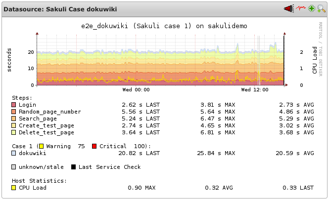

# Sakuli: Installation in OMD
This chapter describes all neccessary steps to configure OMD (Open Monitoring Distribution, which contains Nagios, Shinken, Icinga, and Naemon) to monitor Sakuli test cases executed on a remote machine. OMD/Thruk is highly receommended, but any other Nagios based system will do also. (The steps may be different then…). 

This chapter handles the configuration of the monitoring core "Nagios"; the settings for Icinga and Shinken may differ slightly. 

## Requirements
* [OMD](http://www.omdistro.org) 1.x installed on a Linux distribution of your choice
* a running OMD site (here: *sakuli*)

## Download

Download the newest Sakuli version from [http://labs.consol.de/sakuli/install](http://labs.consol.de/sakuli/install) and decompress it into a temporary folder: 
      
		cd /tmp
		wget http://labs.consol.de/sakuli/install/sakuli-zipped-release-v0.4.4.zip
		unzip sakuli-zipped-release-v0.4.4.zip
	
The following steps will require some files out of the extracted directory */tmp/sakuli/* which will be referenced as *TEMP_FOLDER*. 

## General preparations
All steps should be done as the OMD site user *sakuli*:

		su - sakuli
		
### Nagios

Sakuli will produce HTML formatted output. Tell Nagios not to escape HTML tags: 

	OMD[sakuli]:~$ vim etc/nagios/cgi.cfg
		escape_html_tags=0

## PNP4Nagios
### RRD Storage Type

Normally, RRDtool would create one single RRD file for each Nagios service, containing one ore more data source (=performance data "row"). This number of datasources can't be changed after creation. 

Fortunately, PNP4Nagios is able to let RRDtool create one RRD file for each data source (=Storage type "multiple"). This is of great importance for Sakuli checks, because the number of steps can change by time (=if you are adding/deleting some).

Verify `RRD_STORAGE_TYPE` in *process_perfdata.cfg*: 

	OMD[sakuli]:~$ vim ~/etc/pnp4nagios/process_perfdata.cfg
	  RRD_STORAGE_TYPE = MULTIPLE

If this value is "SINGLE" on your system and you do not want to change it globally, use the custom check_command cfg file. PNP4Nagios will then use storage type "MULTIPLE" only for this check_command then:  

	OMD[sakuli]:~$ cp [TEMP_DIR]/setup/nagios/check_sakuli.cfg ~/etc/pnp4nagios/check_commands/

### PNP graph template

Copy the PNP4nagios graph template into the templates folder: 

	OMD[sakuli]:~$ cp [TEMP_DIR]/setup/nagios/check_sakuli.php ~/etc/pnp4nagios/templates/

## Receivers
Depending on your environment, you probably want to set up on of these two possible receiver types. 

  * [Setting up the Sakuli result database in OMD](receivers/database.md#omd-configuration)
  * [Setting up Nagios to receive Gearman results from Sakuli clients](receivers/gearman.md#omd-configuration)

## Include CPU/Mem graphs in Sakuli graphs (optional) 

If Sakuli reports a long check runtime, you should first have a look on the CPU/Memory graphs on the Sakuli client machine, because performance bottlenecks on this machine affect e2e tests, too. 
The following optional enhancement imports the CPU/Memory graph lines of the Sakuli test client into the suite/case graph. 

 

### add CPU load check (Linux)

Add this service to Nagios: 

	define service {
	  service_description            CPU_Load
	  hostgroup_name                 sakulihost
	  use                            generic-service,srv-pnp
	  check_command                  check_local_load!2.5,1.5,1!5,3.5,2
	}

Add this host macro to every Nagios host where Sakuli checks are defined: 
	
	_E2E_CPU_HOST                  sakulihost
	_E2E_CPU_SVC                   CPU_Load_load5

### add CPU/Mem usage check (Windows)
If not yet done, install NSClient++ on all Sakuli Windows clients. 

Add the command check_nrpe_arg:
		vim ~/etc/nagios/conf.d/commands.cfg
		
		define command {
		  command_name                   check_nrpe_arg
		  command_line                   $USER1$/check_nrpe -H $HOSTADDRESS$ -c $ARG1$ -a $ARG2$
		}

Then add these services to Nagios: 

		define service {
		  service_description          CPU_Usage
		  host_name                 	win7sakuli
		  use                          generic-service,srv-pnp
		  check_command                check_nrpe_arg!CheckCPU!warn=80% crit=90% time=15 time=5 time=1 ShowAll
		}

		define service {
		  service_description          Mem_Usage
		  host_name                 	win7sakuli
		  use                          generic-service,srv-pnp
		  check_command                check_nrpe_arg!CheckMem!MaxWarn=80% MaxCrit=90% ShowAll type=page type=paged type=physical type=virtual
		}
 
Add these host macros to every Nagios host where Sakuli checks are defined: 

		_E2E_CPU_HOST                   win7sakuli
		_E2E_CPU_SVC                   CPU_Usage_5
		_E2E_MEM_HOST                   win7sakuli
		_E2E_MEM_SVC                   Mem_Usage
		
Note: The value of `_E2E_CPU_SVC` and `_E2E_MEM_SVC` represent the file name of the corresponding RRD file. `CPU_Usage_5` for example means to load the CPU usage data from `$OMD_ROOT/var/pnp4nagios/perfdata/[_E2E_CPU_HOST]/CPU_Usage_5.rrd`. 

### Change PNP working mode

The host macros created in the step before must appear in the PNP-XML file of the service (side note: this should be done after each new check result; if not, see `XML_UPDATE_DELAY` in *etc/pnp4nagios/process_perfdata.cfg*). The sakuli PNP template is prepared to watch for this macros and, if present, to include the CPU/Mem graphs. 

OMD runs PNP by default in [Bulk Mode with NPCD and npcdmod.o](http://docs.pnp4nagios.org/pnp-0.6/modes#bulk_mode_with_npcdmod). In this mode the broker module `npcdmod.o` fetches the performance from the monitoring core and stores them in *var/spool/perfdata*. The format of this files is not expandable with custom variables - therefore the mode has to be changed to "Bulk mode with npcdmod.o". (the performance of both modes will be equal). 

In [Bulk mode with npcdmod.o](http://docs.pnp4nagios.org/pnp-0.6/modes#bulk_mode_with_npcd) the format of performance data written by the core to the spool directory can be freely defined with `service_perfdata_file_template`. In the following code block you can see that the four variables were added to the template. Perfdata spool files are then moved to *var/spool/perfdata* every 15 seconds. Remember to use the correct OMD site name:

	vim ~/etc/nagios/nagios.d/pnp4nagios.cfg

	process_performance_data=1
		
	# this line has to be disabled; otherwise you will get duplicate perfdata
	# broker_module=/omd/sites/[OMD_SITE]/lib/npcdmod.o config_file=/omd/sites/[OMD_SITE]/etc/pnp4nagios/npcd.cfg
	
	# services
	service_perfdata_file=/omd/sites/[OMD_SITE]/var/pnp4nagios/service-perfdata
	service_perfdata_file_template=DATATYPE::SERVICEPERFDATA\tTIMET::$TIMET$\tHOSTNAME::$HOSTNAME$\tSERVICEDESC::$SERVICEDESC$\tSERVICEPERFDATA::$SERVICEPERFDATA$\tSERVICECHECKCOMMAND::$SERVICECHECKCOMMAND$\tHOSTSTATE::$HOSTSTATE$\tHOSTSTATETYPE::$HOSTSTATETYPE$\tSERVICESTATE::$SERVICESTATE$\tSERVICESTATETYPE::$SERVICESTATETYPE$\tE2ECPUHOST::$_HOSTE2E_CPU_HOST$\tE2ECPUSVC::$_HOSTE2E_CPU_SVC$\tE2EMEMHOST::$_HOSTE2E_MEM_HOST$\tE2EMEMSVC::$_HOSTE2E_MEM_SVC$
	service_perfdata_file_mode=a
	service_perfdata_file_processing_interval=15
	service_perfdata_file_processing_command=omd-process-service-perfdata-file
		
	# hosts
	host_perfdata_file=/omd/sites/[OMD_SITE]/var/pnp4nagios/host-perfdata
	host_perfdata_file_template=DATATYPE::HOSTPERFDATA\tTIMET::$TIMET$\tHOSTNAME::$HOSTNAME$\tHOSTPERFDATA::$HOSTPERFDATA$\tHOSTCHECKCOMMAND::$HOSTCHECKCOMMAND$\tHOSTSTATE::$HOSTSTATE$\tHOSTSTATETYPE::$HOSTSTATETYPE$
	host_perfdata_file_mode=a
	host_perfdata_file_processing_interval=15
	host_perfdata_file_processing_command=omd-process-host-perfdata-file

Check the perfdata processing commands (should be present already; watch for the OMD site name!)

	vim ~/etc/nagios/conf.d/pnp4nagios.cfg

	define command{
		command_name    omd-process-service-perfdata-file
		command_line    /bin/mv /omd/sites/[OMD_SITE]/var/pnp4nagios/service-perfdata /omd/sites/[OMD_SITE]/var/pnp4nagios/spool/service-perfdata.$TIMET$
	}
 
	define command{
		command_name    omd-process-host-perfdata-file
		command_line    /bin/mv /omd/sites/[OMD_SITE]/var/pnp4nagios/host-perfdata /omd/sites/[OMD_SITE]/var/pnp4nagios/spool/host-perfdata.$TIMET$
	}

Restart the OMD site to unload the *npcdmod.o* module. 

Now head over to the Installation of a [Windows](installation-windows.md) or [Linux](installation-ubuntu.md) client.  
