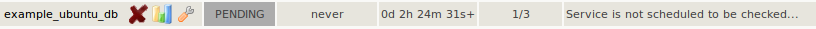

# Sakuli: Installation in OMD
This chapter describes all neccessary steps to configure OMD (Open Monitoring Distribution, which contains Nagios, Shinken, Icinga, and Naemon) to monitor Sakuli test cases executed on a remote machine. OMD is highly receommended, but any other Nagios installation will do also. ()The steps may be different then…). 

This chapter handles the configuration of the monitoring core "Nagios"; the settings for Icinga and Shinken may differ slightly. 

## Requirements
* [OMD](http://www.omdistro.org) installed on a Linux distribution of you choice
* a running OMD site (here: *sakuli*)

## Download

* Create a temporary folder (called *TEMP_FOLDER* in the following) somewhere on the OMD machine and change into it
* Download and unzip *sakuli-zipped-release-v0.4.0.zip*:

      wget https://raw.github.com/ConSol/sakuli/master/install/sakuli-zipped-release-v0.4.0-SNAPSHOT.zip

## Nagios
### 
Tell Nagios not to escape HTML tags: 

	OMD[sakuli]:~$ vim etc/nagios/cgi.cfg
		escape_html_tags=0

## PNP4Nagios
### RRD Storage Type
Make sure that your RRD files are stored in mode "MULTIPLE". 

Become Site user and verify RRD_STORAGE_TYPE in *process_perfdata.cfg*: 

	su - sakuli
	OMD[sakuli]:~$ vim ~/etc/pnp4nagios/process_perfdata.cfg
	  RRD_STORAGE_TYPE = MULTIPLE

If this value is "SINGLE" on your system and you do not want to change it globally, use the custom check_command cfg file. PNP4Nagios will use storage type "MULTIPLE" only for this check_command then:  

	OMD[sakuli]:~$ cp [TEMP_DIR]/sakuli/setup/nagios/check_sakuli_db_suite.cfg ~/etc/pnp4nagios/check_commands/
	  
Some background information: 

Normally, RRDtool would create one single RRD file for each Nagios service, containing one ore more data source (=performance data "row"). This number of datasources can't be changed after creation. 

Fortunately, PNP4Nagios is able to let RRDtool create one RRD file for each data source. This is of great importance for Sakuli checks, because the number of FIXME steps can change by time (=if you are adding/deleting some). 

### PNP graph template

Copy the PNP4nagios graphh template into the templates folder (replace the ^^^^ marked sitename with your sitename, of other): 

	OMD[sakuli]:~$ cp [TEMP_DIR]/sakuli/setup/nagios/check_sakuli_db_suite.php ~/etc/pnp4nagios/templates/
	OMD[sakuli]:~$ sed -i 's/sitename/sakuli/g' ~/etc/pnp4nagios/templates/check_sakuli_db_suite.php
							          ^^^^^

## Database

### enable Site-MySQL
If not already done for other reasons, a site-specific MySQL instance has to be started. That's the place where all Sakuli clients will store their check results. 

Become site user

	su - sakuli 

Stop the OMD site:

	OMD[sakuli]:~$ omd stop

Start the OMD configuration menu

	OMD[sakuli]:~$ omd config
	
Select *Addons -> MYSQL -> ON* and exit the menu. 

Open *~/.my.cnf* and set the following values: 

	OMD[sakuli]:~$ vim .my.cnf
	# or any other higher
	 port = 3007  
	# bind on all interfaces
	 bind-address = 0.0.0.0 
	# enable network access
	 #skip-networking

Create the system tables for the new database and start OMD afterwards. You should see now OMD coming up with a dedicated MySQL instance: 

	OMD[sakuli]:~$ mysql_install_db 
	OMD[sakuli]:~$ omd start
	 Starting dedicated Apache for site sakuli...OK
  	 Starting MySQL... .OK.
	 Starting rrdcached...OK
	 Starting npcd...OK
	 Starting nagios...OK
	 Initializing Crontab...OK

### create Sakuli DB and user

Create the Sakuli database using the SQL script within the repository: 

	OMD[sakuli]:~$ mysql < [TEMP_FOLDER]/sakuli/setup/database/create_and_drop_database.sql
	
Create the database user which is used by all clients to write their check results: 

	OMD[sakuli]:~$ mysql
	  grant ALL on sahi.* to 'sahi'@'%' identified by 'sahi';
	  flush privileges;
	  quit
	  
Now you should be able to do a first connection test with *check_mysql_health*: 

	OMD[sakuli]:~$ 	~/lib/nagios/plugins/check_mysql_health -H [IP] --username sahi --password sahi --database sahi --port 3307 --mode connection-time
	  OK - 0.24 seconds to connect as sahi | connection_time=0.2366s;1;5

### check_mysql_health setup

To fetch Sakuli's check results from the database, Nagios uses the plugin [check_mysql_health](http://labs.consol.de/lang/de/nagios/check_mysql_health/), which is already contained in OMD. 

#### CheckMySQLHealthSakuli.pm

The Perl module *CheckMySQLHealthSakuli.pm*  enhances the functionality of *check_mysql_health* by introducing the mode *--my-sakuli-suite*. 

Create the *etc* directory for *check_mysql_health* and copy the module there: 

	OMD[sakuli]:~$ mkdir ~/etc/check_mysql_health
	OMD[sakuli]:~$ cp [TEMP_FOLDER]/sakuli/setup/nagios/CheckMySQLHealthSakuli.pm ~/etc/check_mysql_health/

#### resource.cfg
Set the USER macros in resource.cfg - of course you can choose other values too (remember then to use the right ones in all other steps).

	OMD[sakuli]:~$ vim etc/nagios/resource.cfg
	  # database name
	  $USER10$=sahi
	  # database user
	  $USER11$=sahi
	  # database password
	  $USER12$=sahi
	  # database port
	  $USER13$=3007
	  # check_mysql_health dyndir
	  $USER15$=/opt/omd/sites/sakuli/etc/check_mysql_health/
	  # database IP
	  $USER16$=[IP]
	  
#### Nagios configuration
Create a new check_command: 

	# check_command for Sakuli 
	# --name = Suite ID
	# --name2 = number of seconds the last result is allowed to be old
	define command {
	  command_name                   check_sakuli_db_suite
	  command_line                   $USER1$/check_mysql_health \
      	--hostname=$USER16$ \
        --database=$USER10$ \
        --username=$USER11$ \
        --password=$USER12$ \
        --mode=my-sakuli-suite \
        --name='$ARG1$' \
        --name2=$ARG2$ \
        --report=html \
        --port=$USER13$ \
        --with-mymodules-dyn-dir=$USER15$
	}

Create a host object for the Sakuli test client: 

	define host {
	  host_name                      win7sakuli
	  alias                          Windows 7 Sakuli
	  address                        [IP]
	  use                            generic-host
	}

Create the following services objects for the first test case: 

	define service {
	  service_description            sakuli_demo
	  host_name                      win7sakuli
	  use                            generic-service,srv-pnp
	  check_command                  check_sakuli_db_suite!sakuli_demo!3600
	}
	
Reload OMD - you should see now the Sakuli host with one service attached: 

If you want to see CPU and Mem graphs within the Sakuli PNP graphs: 
 
* Add these services to win7sakuli: 

		define service {
		  service_description          CPU_Usage
		  host_name                 	win7sakuli
		  use                          generic-service
		  check_command                check_nrpe_arg!CheckCPU!warn=80% crit=90% time=15 time=5 time=1 ShowAll
		}

		define service {
		  service_description          Mem_Usage
		  host_name                 	win7sakuli
		  use                          generic-service
		  check_command                check_nrpe_arg!CheckMem!MaxWarn=80% MaxCrit=90% ShowAll type=page type=paged type=physical type=virtual
		}
 
* Add these host macros to win7sakuli: 

		_E2E_CPU_HOST                   win7sakuli
		_E2E_CPU_SVC                   CPU_Usage
		_E2E_MEM_HOST                   win7sakuli
		_E2E_MEM_SVC                   Mem_Usage

* The previously created host macros must appear in the PNP-XML file of the service. OMD runs PNP by default in "Bulk Mode with npcdmod", where the performance data are read directly from the Nagios core and are written to *var/spool/perfdata*. The format is not changeable - therefore the mode has to be changed (watch for the OMD site name!):

		vim ~/etc/nagios/nagios.d/pnp4nagios.cfg
		
		process_performance_data=1
		# broker_module=/omd/sites/sakuli/lib/npcdmod.o config_file=/omd/sites/sakuli/etc/pnp4nagios/npcd.cfg
		#
		# Service Performance-Daten
		service_perfdata_file=/omd/sites/sakuli/var/pnp4nagios/service-perfdata
		service_perfdata_file_template=DATATYPE::SERVICEPERFDATA\tTIMET::$TIMET$\tHOSTNAME::$HOSTNAME$\tSERVICEDESC::$SERVICEDESC$\tSERVICEPERFDATA::$SERVICEPERFDATA$\tSERVICECHECKCOMMAND::$SERVICECHECKCOMMAND$\tHOSTSTATE::$HOSTSTATE$\tHOSTSTATETYPE::$HOSTSTATETYPE$\tSERVICESTATE::$SERVICESTATE$\tSERVICESTATETYPE::$SERVICESTATETYPE$\tE2ECPUHOST::$_HOSTE2E_CPU_HOST$\tE2ECPUSVC::$_HOSTE2E_CPU_SVC$\tE2EMEMHOST::$_HOSTE2E_MEM_HOST$\tE2EMEMSVC::$_HOSTE2E_MEM_SVC$
		service_perfdata_file_mode=a
		service_perfdata_file_processing_interval=15
		service_perfdata_file_processing_command=omd-process-service-perfdata-file
		#
		# Host Performance-Daten
		#
		host_perfdata_file=/omd/sites/sakuli/var/pnp4nagios/host-perfdata
		host_perfdata_file_template=DATATYPE::HOSTPERFDATA\tTIMET::$TIMET$\tHOSTNAME::$HOSTNAME$\tHOSTPERFDATA::$HOSTPERFDATA$\tHOSTCHECKCOMMAND::$HOSTCHECKCOMMAND$\tHOSTSTATE::$HOSTSTATE$\tHOSTSTATETYPE::$HOSTSTATETYPE$
		host_perfdata_file_mode=a
		host_perfdata_file_processing_interval=15
		host_perfdata_file_processing_command=omd-process-host-perfdata-file

* Create the perfdata processing commands (should be present already; watch for the OMD site name!)

		# ~/etc/nagios/conf.d/pnp4nagios.cfg
		define command{
          command_name    omd-process-service-perfdata-file
          command_line    /bin/mv /omd/sites/sakuli/var/pnp4nagios/service-perfdata /omd/sites/sakuli/var/pnp4nagios/spool/service-perfdata.$TIMET$
        }
 
		define command{
          command_name    omd-process-host-perfdata-file
          command_line    /bin/mv /omd/sites/sakuli/var/pnp4nagios/host-perfdata /omd/sites/sakuli/var/pnp4nagios/spool/host-perfdata.$TIMET$
		}

* Restart the OMD site to unload the *npcdmod.o* module. Nagios will write the performance data into the tmp-files. The perfdata processing commands will rotate them into the spool directory, where NPCD will read them. 

Now head over to the Installation of a [Windows](../installation-windows.md) or [Linux](../installation-ubuntu.md) client.  
