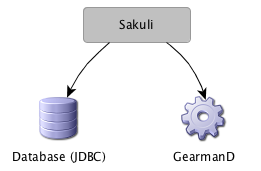

# Installation guide for Sakuli under Windows 7
You probably came from the page "Introduction" - if not, and if you are nor sure what Sakuli is, please read first [README](../README.md). 

## Prerequisites
The following installation manual assumes that...

* you have a fresh installed Windows 7 (Home/Professional/whatever) machine in front of you. 
* all OS updates and drivers are installed
* this machine has access to the internet
* the local firewall is disabled
* there is a user account (e.g. "sakuli") with admin rights; if possible, disable any mechanism which can lock the account after x false login attempts. 
* for best results, there is no service/application running which could show dialogues which could disturbe e2e checks (e.g. messages indicating a scheduled antivirus scan, custom software installation procedures, ...)
* you have finished the [OMD Preparation](installation-omd.md) instructions

We recommend to run Sakuli clients on virtual machines, as they are easy to manage. 

## Preparations
The steps in [Sakuli Client Troubleshooting ("How to make tests more reliable")](troubleshooting-sakuli-client.md) are optional (Sakuli will run even without doing them), but will improve the check quality/reliability. We recommend to do this first and then come back here. 

## Installation of Sakuli
This chapter includes the installation of Sakuli (which already has Sikuli on board) as well as the manual installation of Sahi. 

### Java JRE
* Install Java7 JRE. (Make sure that you do **not install ASK toolbar**, which is enabled by default!)
* Modify PATH: 
	* From the desktop, right-click *My Computer* and click *Properties*
	* In *System Properties*, click on *Advanced*
	* Select the `Path` variable in the Systems Variable section and click *Edit*. Depending on the "Program Files" folder Java is installid in, add one of the following lines to the very end of the string (including the semicolon), apply and reboot: 

			;C:\Program Files\Java\jre7\bin
			;C:\Program Files (x86)\Java\jre7\bin
	

### Sakuli - Install the sakuli-zipped-release
* Download the latest version of Sakuli from  [http://labs.consol.de/sakuli/install](http://labs.consol.de/sakuli/install)
* Unzip the downloaded archive to `C:\\` as destination folder (=it will decompress into `C:\sakuli`). 
* From the desktop, right-click *My Computer* and click *Properties*
	* In *System Properties*, click on *Advanced*
	* Create a new user variable **%SAKULI_HOME%**: 
		* Name: `SAKULI_HOME`
		* Value: `C:\sakuli`
	* Create a new user variable **%PATH%**: 
		* Name: `PATH`
		* Value: `%SAKULI_HOME%\bin\lib\libs`

**Alternative download:** Create a local Sakuli repository by cloning from [https://github.com/ConSol/sakuli/](https://github.com/ConSol/sakuli/).

### Configuration

Some configuration settings in the file `%SAKULI_HOME%\_include\sakuli.properties`: 

#### Encryption:
  * To make usage of the Sakuli encryption feature, set the encryption interface property like `sakuli.encryption.interface=eth3`. For further informations jump to [encryption of secrets](sakuli-manual.md) and come back here.
  * If there is no need of any encryption feature, set the property `sakuli.encryption.interface.testmode=true`.

#### Receivers

Sakuli can send test result to "Receivers", which can be currently GearmanD servers (such as Nagios monitoring systems with mod-gearman) and JDBC databases. If no receiver is defined, a result summary is printed out in the end of a suite. 
  

For the configuration of receivers on the OMD server side, see [Receivers in OMD](installation-omd.md#receivers)

Depending on your environment, you probably want to set up on of these two possible receiver types. 

  * [Setting up Sakuli to send results to the Database](receivers/database.md#sakuli-configuration)
  * [Setting up Sakuli to submit results to the Gearman Receiver](receivers/gearman.md#sakuli-configuration)

#### Company proxy	
(optional) Configure your company proxy like described under [Sakuli-Manual - Proxy-Settings](sakuli-manual.md#proxy-settings)

#### Others 
Some further default configuration can be done, see therefore the comments in [sakuli.properties](../core/src/main/_include/sakuli.properties). This default settings will be valid for all test suites of the Sakuli installation. Each single property can be overridden in the property file `testsuite.properties` of the test suite folders as well, see e.g. [testsuite.properties](../sakuli_test_suites/example/testsuite.properties). Overriding of properties makes it possible to configure the behaviour of each test suite individually.

	
### Sahi

* Download the latest version of Sahi from [http://sourceforge.net/projects/sahi/files/latest/download?source=files](http://sourceforge.net/projects/sahi/files/latest/download?source=files)
* Unpack the downloaded file and start the installation by double clicking on `install_sahi_v44_20130429.jar`.
	* Installation path: `%SAKULI_HOME%\sahi`
	* select all packages to install

Now it's time to start the Sahi controller for the first time. Open "Start Sahi" from your desktop or from the start menu. 

 	

The Dashboard should list now all available browsers on this system (if not, go to [No browsers in Dashboard](../docs/troubleshooting-sakuli-client.md#no-browsers-in-dashboard): 

 	
Click on any browser you like; Sahi will start it and present the default start page: 

 

If neccessary, define now your company's proxy within Sahi: [Proxy settings](../docs/sakuli-manual.md)

Sahi is now installed completely.

### PhantomJS (Optional)
	
Currently, each Sakuli test will start a browser, even for pure Sikuli GUI tests (=where you don't need any browser). In that case, the headless browser *phantomJS* does the trick. 

* Download the latest version of phantomJS from [http://phantomjs.org](http://phantomjs.org)
* Open the ZIP file and copy `phantomjs.exe` to `%SAKULI_HOME%\phantomjs` (create that folder)
* Save [sahi.js](http://labs.consol.de/sakuli/install/3rd-party/phantom/sahi.js) into `%SAKULI_HOME%\phantomjs`

<pre>
	&lt;browserType&gt; 
		&lt;name&gt;phantomjs&lt;/name&gt; 
		&lt;displayName&gt;PhantomJS&lt;/displayName&gt; 
		&lt;icon&gt;safari.png&lt;/icon&gt; 
		&lt;path&gt;C:\sakuli\phantomjs\phantomjs.exe&lt;/path&gt; 
		&lt;options&gt;--proxy=localhost:9999 C:\sakuli\phantomjs\sahi.js&lt;/options&gt; 
		&lt;processName&gt;phantomjs.exe&lt;/processName&gt; 
		&lt;capacity&gt;100&lt;/capacity&gt; 
		&lt;force&gt;true&lt;/force&gt; 
    &lt;/browserType&gt;
</pre>

Now it's time to setup the first Sakuli check: go to [First steps on Windows 7](../docs/firststeps-windows.md).

## Additional tools
### Browser 
Install any of your desired browsers (Firefox, Chrome, Opera, …) and configure them in `browser_types.xml` as described in the [troubleshooting section](../docs/troubleshooting-sakuli-client.md#no-browsers-in-dashboard).

It is recommended to install at least Mozilla Firefox. 
### Greenshot 
To take screenshots which should be used by Sikuli, you need a handy screenshot capturing tool. We highly recommend the installation of [Greenshot](http://www.getgreenshot.org), but any other tool which is able to save screenshots as JPG/PNG is possible, too. 
### Notepad++
Install an advanced text editor to edit Sakuli test cases. We recommend [Notepad++](http://notepad-plus-plus.org/).
	
