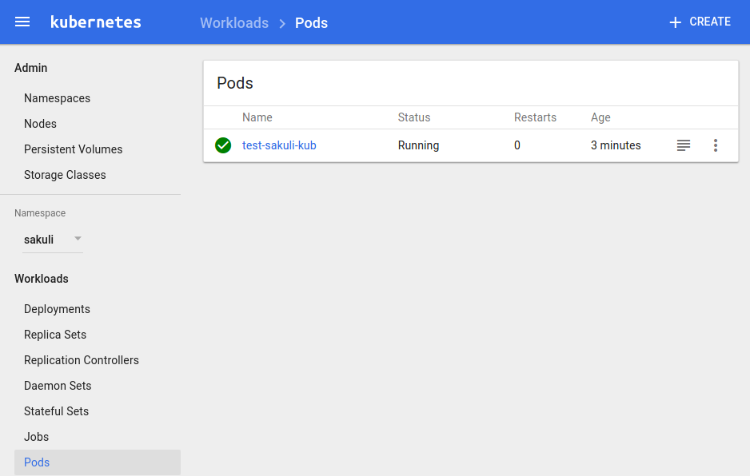
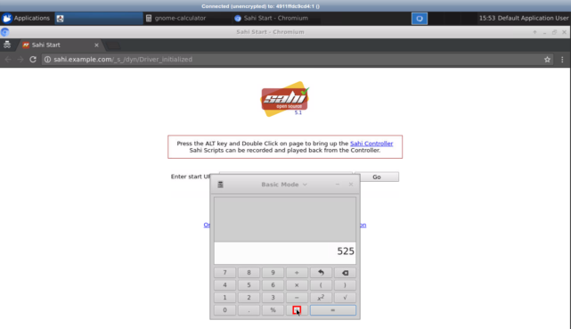

# Kubernetes usage of the Sakuli E2E testing and monitoring Docker images

First go the folder of the Kubernetes conf:

    cd <project-path>/docker/kubernetes

## Start sakuli test execution pod

    kubectl create -f kubernetes.sakuli.example.pod.run.yaml

This creates the following components in the Kubernetes cluster:
* new Namespace `sakuli`
* 1 Pod with the sakuli container running
* 1 Service to make the container ports `6901` and `5901` accessible 

Take a look to the running pods on the Kubernetes dashboard

    http://<kubernets-cluster-ip>:30000/#!/pod?namespace=sakuli

or get a list of all running pods in the `sakuli` namespace:

    kubectl get pod --namespace=sakuli --show-all
    
Also you can take a look at the log output
    
    kubectl logs --namespace=sakuli test-sakuli-kub
    
If you wan't to take a look to the UI during the test execution, you can connect (only during the container runtime) to the container through the defined external HTTP port `32001` of the service `test-sakuli-kub`:

    http://<kubernets-cluster-ip>:32001/vnc_auto.html?password=sakuli&view_only=true

 

## Delete sakuli test execution pod

    kubectl delete -f kubernetes.sakuli.example.pod.run.yaml