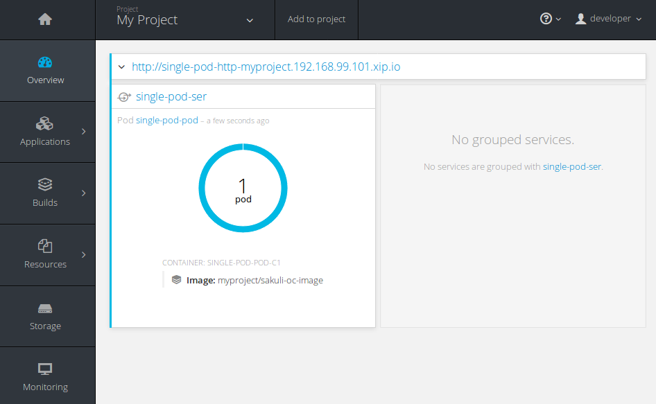

# OpenShift usage of the Sakuli E2E testing and monitoring Docker images

The following content uses as example the image `consol/sakuli-ubuntu-xfce ` of the Dockerfile `Dockerfile.sakuli.ubuntu.xfce`.
First you have to create your OpenShift project

    cd openshift                
    oc new-project my-project   

Then you can use the provided templates as follows:

## Run the image from Dockerhub

    cd openshift                
    oc new-project my-project   

As soon as you are logged in and have selected your oc project, you can simply run the image by using the configuration `openshift.sakuli.example.pod.run.yaml`:

    oc process -f openshift.sakuli.example.pod.run.yaml -v E2E_TEST_NAME=single-pod | oc create -f -

After the deployment you will see at your management UI the new deployed service:

[https://__YOUR-OS-MANAGEMENT-URL__/console/project/my-project/overview]()

Over the URL you can look and control the fresh deployed container via the web-vnc interface:

[http://my-run-only-pod-my-project.__YOUR-OS-URL__/?password=sakuli]()

If you want to use another Sakuli Image just use the `IMAGE` var:

    oc process -f openshift.sakuli.example.pod.run.yaml -v E2E_TEST_NAME=single-pod -v IMAGE=consol/sakuli-ubuntu-icewm | oc create -f -

## Build & Run your own image

If you want to build the image in your own infrastructure just use the configuration `openshift.sakuli.example.image.build.yam`

    oc process -f openshift.sakuli.example.image.build.yaml -v IMAGE=sakuli-oc-image | oc create -f -

Or if you wan't to build a custom Dockerfile in a specific branch:

    oc process -f openshift.sakuli.example.image.build.yaml \
        -v IMAGE=sakuli-oc-image-icewm \
        -v SOURCE_REPOSITORY_REF=dev \
        -v SOURCE_DOCKERFILE=Dockerfile.sakuli.ubuntu.icewm \
        | oc create -f -

### Use images from oc docker registry

To use an already builded image from the internal OpenShift registry you have to specify the image in the pattern `<registry-ip>/<your-project>/<image-name>[:<tag>]`:

    oc process -f openshift.sakuli.example.pod.run.yaml -v IMAGE=10.0.0.X:5000/my-project/sakuli-oc-image,E2E_TEST_NAME=oc-image-test-2 | oc create -f -

## Usage of git based test definitions through volume mounts

An effective way to execute your own Sakuli Tests is, that you mount the testsuite into the container. Therefore you can use the template `openshift.sakuli.gitvolume.pod.run.yaml`. The template will checkout the git repository and mount it as read-only volume into the container, where Sakuli will execute it:

    oc process -f openshift.sakuli.gitvolume.pod.run.yaml \
        -v GIT_TEST_SUITE_REPO=https://github.com/ConSol/sakuli-examples \
        -v GIT_TEST_SUITE_PATH=docker-xfce/part_01/example_xfce \
        | oc create -f -

If something went wrong, you maybe have to enable this volume type in the cluster:

### Configure use of `gitRepo` volumes:

Login as administrator:

    oc login -u system:admin

Edit the security :

    oc edit securitycontextconstraints/restricted

add `gitRepo` to `volumes`:

    volumes:
    - configMap
    - downwardAPI
    - emptyDir
    - persistentVolumeClaim
    - secret
    - gitRepo

## Other useful commands

### Delete specific application or E2E test

    oc process -f openshift.sakuli.example.pod.run.yaml -v E2E_TEST_NAME=single-job | oc delete --grace-period=5 -f -

### Delete all running pods and configs

    oc delete dc --all && oc delete routes --all && oc delete pods --all && oc delete services --all && oc delete jobs --all
