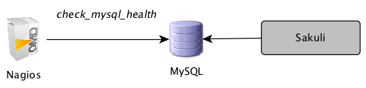
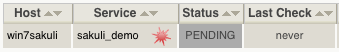
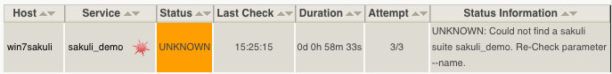

# Database Receiver
This page describes how Sakuli can be configured to write its test results into a MySQL database which is checked asynchronously by the monitoring system with *check_mysql_health*. 

 
## OMD Configuration

### Enabling the site's MySQL Database
If not already done for other reasons, a site-specific MySQL instance has to be started. That's the place where all Sakuli clients will store their check results. 

Stop the OMD site:

	OMD[sakuli]:~$ omd stop

Start the OMD configuration menu

	OMD[sakuli]:~$ omd config
	
Select *Addons -> MYSQL -> ON* and exit the menu. 

Open *~/.my.cnf* and set the following values: 

	OMD[sakuli]:~$ vim .my.cnf
	# make sure to choose a free port
	 port = 3007  
	# bind on all interfaces
	 bind-address = 0.0.0.0 
	# enable network access
	 #skip-networking

Create the system tables for the new database and start OMD afterwards. You should see now OMD coming up with a dedicated MySQL instance: 

	OMD[sakuli]:~$ mysql_install_db 
	OMD[sakuli]:~$ omd start
	 Starting dedicated Apache for site sakuli...OK
  	 Starting MySQL... .OK.
	 Starting rrdcached...OK
	 Starting npcd...OK
	 Starting nagios...OK
	 Initializing Crontab...
	 

### create Sakuli DB and user

Create the Sakuli database using the SQL script within the repository: 

	OMD[sakuli]:~$ mysql < [TEMP_FOLDER]/setup/database/create_sakuli_database.sql
	
Create the database user which is used by all clients to write their check results: 

	OMD[sakuli]:~$ mysql
	  grant ALL on sakuli.* to 'sakuli'@'%' identified by 'sakuli';
	  flush privileges;
	  quit
	  
Now you should be able to do a first connection test with *check_mysql_health*: 

	OMD[sakuli]:~$ 	~/lib/nagios/plugins/check_mysql_health -H [IP] --username sakuli --password sakuli --database sakuli --port 3307 --mode connection-time
	  OK - 0.24 seconds to connect as sahi | connection_time=0.2366s;1;5

### create Nagios check

To fetch Sakuli's check results from the database, Nagios uses the plugin [check_mysql_health](http://labs.consol.de/lang/de/nagios/check_mysql_health/), which is already contained in OMD. 

#### CheckMySQLHealthSakuli.pm

The Perl module *CheckMySQLHealthSakuli.pm*  enhances the functionality of *check_mysql_health* by introducing the mode *--my-sakuli-suite*. 

Create the *etc* directory for *check_mysql_health* and copy the module there: 

	OMD[sakuli]:~$ mkdir ~/etc/check_mysql_health
	OMD[sakuli]:~$ cp [TEMP_FOLDER]/setup/nagios/CheckMySQLHealthSakuli.pm ~/etc/check_mysql_health/

##### resource.cfg
Set USER macros for static vars in *resource.cfg*, which makes it easy to use them in all nagios checks:  

	OMD[sakuli]:~$ vim ~/etc/nagios/resource.cfg
	  # database name
	  $USER10$=sakuli
	  # database user
	  $USER11$=sakuli
	  # database password
	  $USER12$=sakuli
	  # database port
	  $USER13$=3307
	  # check_mysql_health dyndir
	  $USER15$=/opt/omd/sites/sakuli/etc/check_mysql_health/
	  # database=OMD IP
	  $USER16$=[IP]  
	  
##### Nagios configuration
Create a new check_command: 

	vim ~/etc/nagios/conf.d/commands.cfg
	
	# check_command for Sakuli 
	# --name = Suite ID
	# --name2 = number of seconds the last result is allowed to be old
	define command {
	  command_name                   check_sakuli
	  command_line                   $USER1$/check_mysql_health \
      	--hostname=$USER16$ \
        --database=$USER10$ \
        --username=$USER11$ \
        --password=$USER12$ \
        --mode=my-sakuli-suite \
        --name='$ARG1$' \
        --name2=$ARG2$ \
        --report=html \
        --port=$USER13$ \
        --with-mymodules-dyn-dir=$USER15$
	}

Create a host object for the host on which Sakuli checks will be executed: 

	vim ~/etc/nagios/conf.d/hosts.cfg
	
	define host {
	  host_name                      win7sakuli
	  alias                          Windows 7 Sakuli
	  address                        [IP]
	  use                            generic-host
	}

Create the following service object for the first test case: 

	vim ~/etc/nagios/conf.d/services.cfg
	
	define service {
	  service_description            sakuli_demo
	  host_name                      win7sakuli
	  use                            generic-service,srv-pnp
	  check_command                  check_sakuli!sakuli_demo!3600
	}
	
Reload OMD:

	omd reload
	
Now open Thruk; you should see now the Sakuli host with one service attached: 

Re-scheduling this service should display the UNKNOWN message that the requested suite could not be found. For the moment, this is ok: 

## Sakuli Configuration

Open `%SAKULI_HOME\_include\sakuli.properties` on the Sakuli client and fill in the parameters for the database Sakuli should write the test results to:

    # DEFAULT: false
    sakuli.receiver.database.enabled=true
	
	jdbc.driverClass=com.mysql.jdbc.Driver
    jdbc.host=[IPofOMD]
    jdbc.port=[Database Port]]
    jdbc.database=sakuli
    jdbc.user=sakuli
    jdbc.pw=sakuli
    jdbc.model=sakuli
    jdbc.url=jdbc:mysql://${jdbc.host}:${jdbc.port}/${jdbc.database}

