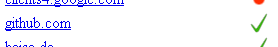

# HTTPS support in Sahi

This documentation is not complete yet. Any help is appreciated. 

## General

### Solution 1: accept self-signed certificates

This will work on most systems, especially the ones you have full control over. 

* Open Sahi Dashboard, start the browser. 
* On the Sahi start page, navigate to the https site you want Sahi to trust (e.g. [https://github.com](https://github.com))
* You will be presented a message that this page "connection is not secure/trusted".
  * On **Firefox**, click **"I understand the risks."**
  * On **Chrome**, click **"Proceed anyway (unsecure)"**
  * On **IE**, click **"Continue to the website (not recommended)"**.
* Once the page has loaded, click **"SSL Manager"** from the Sahi start page
* You should be presented a green check mark right of the https URL, indicating that Chrome accepted the site's certificate, signed by Sahi: 

 

### Solution 2: manual certificate import (browser-specific)

#### Google Chrome (Windows)

* Open Sahi Dashboard, start *Chrome*
* On the Sahi start page, navigate to the https site you want Sahi to trust (e.g. [https://github.com](https://github.com) )
* You will be presented a message that this page "connection is not secure". Click on the **red-crossed locker symbol** left of the URL in the address bar and then **"Certificate information"** 
* Change to tab **"Details"** and press **"Copy to File…"**
* In the following export assistent, save the certificate as **"Cryptographic Message Syntax Standard PKCS #7 Certificates (.P7B)""**
* Go to Chrome preferences, **"Manage certificates"**
* **"Import…"** -> select the exported **.p7b** certificate (in the "Open" dialogue, chnange the filename extension filter to **"PKCS#1"** )
* Choose **"Trusted Root Certification Authorities"** as certificate store
* Accept the Import confirmation.
* Restart Chrome from the Sahi dashboard. 
* From the Sahi start page (step #2), click **"SSL Manager"**
* You should be presented a green check mark right of the https URL, indicating that Chrome accepted the site's certificate, signed by Sahi: 

 

#### Mozilla Firefox
TBD
#### Internet Explorer ####
TBD

