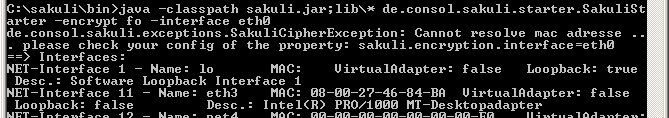
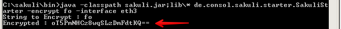

# Sakuli Manual

## Proxy settings
To define your company's proxy, edit your proxy information to the property File `%SAKULI_HOME%/_include/sakuli.properties` in the scetion __SAHI-SCRIPT-RUNNER-PROPERTIES__ like in the following example:

```
### HTTP/HTTPS proxy Settings
### Set these properties, to enable the test execution behind company proxies
# Use external proxy server for HTTP
ext.http.proxy.enable=true
ext.http.proxy.host=proxy.server.com
ext.http.proxy.port=8080
ext.http.proxy.auth.enable=false
ext.http.proxy.auth.name=user
ext.http.proxy.auth.password=password

# Use external proxy server for HTTPS
ext.https.proxy.enable=true
ext.https.proxy.host=proxy.server.com
ext.https.proxy.port=8080
ext.https.proxy.auth.enable=false
ext.https.proxy.auth.name=user
ext.https.proxy.auth.password=password

# There is only one bypass list for both secure and insecure.
ext.http.both.proxy.bypass_hosts=localhost|127.0.0.1|*.internaldomain.com|www.verisign.com
```


## Connecting to Sakuli clients

### Windows 
#### connection types
There are a few way to connect to a Sakuli client machine: 

1. VNC
2. Console of a virtualization platform (ESX, Virtualbox, etc.)
3. Remote Desktop

Sakuli does not run (for the moment at least) headless; for that reason it is crucial that there is always a unlocked, "real" screen available. 

For case 1. and 2. there is nothing special to watch out for, except that the screen must not be locked (see the [installation manual](../docs/installation-windows.md)). Sakuli is always running on the so-called *local console* (what the OS sends out on the graphics adapter).

#### RDP pecularities
For RDP, there are some special things to know. Connecting to the Sakuli test client via RDP **locks any existing local console session of that user** and **attaches (="moves") it to a RDP session**. 

Sakuli will also run within that RDP session. But closing/disconnecting/logging of that RDP session will not unlock the local console session again. Sakuli will see the same as a regular user: the famous blue lock screen. 

##### LOGOFF.bat
As described in the [Windows 7 installation manual](../docs/installation-windows.md)), use instead **LOGOFF.bat** on the Desktop to disconnect the session (right-click and execute it with Administrator privileges!). This will

* first "move" the RDP session back to the local console
* an terminate the RDP session.

##### check_logon_session.ps1
In *sakuli\setup\nagios* you can find **check_logon_session.ps1** which can be used as a client-side check to ensure that the Sakuli user is always logged on, either via RDP or on the local console. Instructions for the imeplentation of this check can be found in the script header. 

Define a service dependency of all Sakuli checks to this logon check; this will ensure that a locked session will not raise false alarms. 

### Ubuntu

## Proxy settings
FIXME


## Secret De-/Encryption
### Encryption

(You probably came from [Installation (Windows 7)](../docs/installation-windows.md) or [Installation (Ubuntu)](../docs/installation-ubuntu.md)- if so, do the following section and jump back to the link mentioned at the end.)

To ensure that secrets (passwords, PIN, etc) never get logged in plain text, they can be encrypted on the command line; Sakuli then decrypts them on runtime (for more information on how to do this, refer to FIXME) to use them on tests. There is no (quick) way to decrypt secrets again on the command line. This is of course no high-secure encryption mechanism but rather a way to obscure things not everybody should see. 

For the encryption, Sakuli uses among other parameters the MAC address of a given network interface card as a salt. When you set up a new Sakuli client, the interface name has to be defined in _sakuli.properties_.    

To determine the correct name of an encryption interface do the following steps on _cmd.exe_ (Windows) or the Unix Shell: 

* Windows:  

			cd %SAKULI_HOME%\bin
			encrypt_password.bat somesecret eth0
		
	* If "eth0" points to an interface with no valid MAC address (e.g. Virtual adapters), you will get a long error message starting with "Cannot resolve mac address". 
	  
	* Select an interface with a valid MAC (here: eth3) and start the script again. The output should be now something like 
	  
	* Remember the Interface name. 

* Linux:

		java -classpath sakuli.jar:lib/* de.consol.sakuli.starter.SakuliStarter -encrypt yourSecrect -interface eth0

If you came here during the [Installation on Windows 7](../docs/installation-windows.md) or [on Ubuntu](../docs/installation-ubuntu.md), go back there now. 

Otherwise: the red arrow shows the encrypted string, which you can copy into the clipboard. 

### Decryption 

To decrypt a secret, use one of the following methods:
 
* [pasteAndDecrypt](./api/sakuli_Environment.md#pasteanddecrypttext)
* [typeAndDecrypt](./api/sakuli_Environment.md#typeanddecrypttext-optmodifiers)
* [decryptSecret](./api/sakuli_Environment.md#decryptsecretsecret)

## Making tests more reliable
### Killing orphaned processes 
FIXME killproc.vbs
