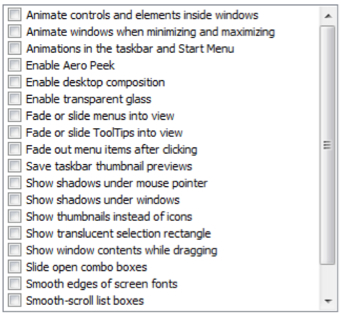

# Sakuli Manual

## Proxy settings
If web tests with Sakuli should go through your company's proxy, edit the property file `%SAKULI_HOME%/_include/sakuli.properties`, section __SAHI-SCRIPT-RUNNER-PROPERTIES__ for both http and https. `auth.username` and `auth.password` are only used if `auth.enable` is set to `true`. 
Use the bypass list to exclude certain URLs from being accessed through the proxy.   
      
    ```
	### HTTP/HTTPS proxy Settings
	### Set these properties, to enable the test execution behind company proxies
	# Use external proxy server for HTTP
	ext.http.proxy.enable=true
	ext.http.proxy.host=proxy.yourcompany.com
	ext.http.proxy.port=8080
	ext.http.proxy.auth.enable=false
	ext.http.proxy.auth.name=user
	ext.http.proxy.auth.password=password
	
	# Use external proxy server for HTTPS
	ext.https.proxy.enable=true
	ext.https.proxy.host=proxy.server.com
	ext.https.proxy.port=8080
	ext.https.proxy.auth.enable=false
	ext.https.proxy.auth.name=user
	ext.https.proxy.auth.password=password
	
	# There is only one bypass list for both secure and insecure.
	ext.http.both.proxy.bypass_hosts=localhost|127.0.0.1|*.internaldomain.com|www.verisign.com
    ```

- - -

# Logging & Error-Screenshot Properties
To customize the logging logic for your purpose, there are to two places to configer it:
#### Properties-Files `sakuli.properties` 
 Set here the common logging settings for sakuli.

  ```
  # If you use the feature resumeOnException, for example with 'new Region("foo",true), then you can config
  # the exception logging like following: If
  #   true  = Exception will appear in the log and on the test suite result
  #   false = Exception will NOT appear in the log file and in the test suite result. In that case you
  #           have to handle it by yourself in the test case, like in this example:
  #            try{
                var foo = fooRegion.find("image.png");
                if (foo == null){
                    throw "your custom exception message";
                }
              } catch (e) {
                handleYourSelf(e);
              }
  
   DEFAULT: true
  akuli.log.exception.onResumeOnException=true
     Log pattern for the logging output.
  
   Log pattern for development with java classes:
   sakuli.log.pattern=%-5level %d{YYYY-MM-dd HH:mm:ss} [%thread]  %logger{36} - %msg%n
  akuli.log.pattern= %-5level [%d{YYYY-MM-dd HH:mm:ss}] - %msg%n
     Sets the output folder for the log files
  akuli.log.folder=${sakuli.testsuite.folder}/_logs
     Sets the output folder for the error screenshots (if activated)
  akuli.screenshot.dir=${sakuli.log.folder}/_screenshots
   Output format for the take screenshots.
   Possible values: jpg, png
  akuli.screenshot.format=jpg
  sakuli.screenshot.format=png
  ```
  
### SLF4J Configuration `sakuli-log-config.xml`
Alo in the include folder you will find a file named `sakuli-log-config.xml`.  
Thre you configure more details in the [Logback](http://logback.qos.ch/) syntax logic. For more detailed information, see
[Lgback configuration](http://logback.qos.ch/manual/configuration.html). 

- - -

## Disable-windows-7-effects

### Disable desktop background 
Set the desktop background to a homogenous color. 

### Disable screen saver and screen locking

Disable everything which can cause the screen to get locked / changed in its appearance.  

### Change theme and title bar colors
Windows 7 comes by default with an "aero" theme, which is quite awkward for Sakuli, because there are many transparency effects which cause window elements to change their appearance dependend on the elements below. For that, change the theme to "Windows Classic".


Furthermore, change the colors of **active** and **inactive** title bars to **non gradient**: 


### Enable Window Activation ###
Windows does not allow per default to bring an application in the foreground. This must be allowed for Sakuli: 

* Start -> "regedit"
* [ HKEY_CURRENT_USER\Control Panel\Desktop ]
* "ForegroundLockTimeout" (DWORD) => "0" (default = 30d40xh)
### Disable Window Animation ###
Disable the animation of window minimize/maximize actions: 

* "regedit"
* [HKEY_CURRENT_USER\Control Panel\Desktop\WindowMetrics ]
* "MinAnimate" (String) => "0" 
### Disable Cleartype ###
ClearType ("antialiasing" / "Font Smoothing"), is a technology that is used to display computer fonts with clear and with smooth edges. The MS Terminal Services Client (RDP client) enables this feature depending on the available bandwidth, which means that screenshots made within RDP sessions may be taken without ClearType, but during the test execution on the local console, they are compared with the desktop displayed in ClearType. Although we only had problems with RDP and Cleartype, it is a good idea to disable ClearType completely:

* "regedit"
* [ HKEY_CURRENT_USER\Control Panel\Desktop ]
* "FontSmoothingType" (DWORD) => "0" 

### Disable all visual effects ###
* Start -> Control Panel -> System -> Advanced
* Performance -> Settings -> Visual Effects -> Custom
* Disable everything: 



#### RDP related settings ####
The following steps have only to be done if you are accessing the Sakuli Client with RDP. 
##### Disable Clipboard Sharing #####
The "paste" function of Sakuli uses the clipboard at runtime to decrypt and paste passwords. For this reason, the clipboard exchange of the Sakuli client and the RDP client should be suppressed in the settings tab of your **local Remote Desktop client**:


This can be set globally in the registry **of your local host**: 

* "regedit"
* [ HKEY_CURRENT_USER\Software\Microsoft\Terminal Server Client ]
* "DisableDriveRedirection" (DWORD) => "1" 

##### Disable the "GUI-less" mode #####
If you minimize the Remote Desktop window (the window that display the remote computer’s desktop), the operating system switches the remote session to a "GUI-less mode" which does not transfer any window data anymore. As a result, Sakuli is unable to interact with the tested application’s GUI, as the whole screen is not visible.

To disable the "GUI-less" mode **on your local host**: 

* "regedit"
* [ HKEY_CURRENT_USER\Software\Microsoft\Terminal Server Client ]
* "RemoteDesktop_SuppressWhenMinimized" (DWORD) => "2"

## Connecting to Sakuli clients

### Windows 
#### connection types
There are a few way to connect to a Sakuli client machine: 

1. VNC
2. Console of a virtualization platform (ESX, Virtualbox, etc.)
3. Remote Desktop
4. (perhaps more…) 

Sakuli does not run (for the moment at least) headless; for that reason it is crucial that there is always a unlocked, "real" screen available. 

For case 1. and 2. there is nothing special to watch out for, except that the screen must not be locked (see the [installation manual](../docs/installation-windows.md)). Sakuli is always running on the so-called *local console* (what the OS sends out on the graphics adapter).

#### RDP pecularities
For RDP, there are some special things to know. Connecting to the Sakuli test client via RDP **locks any existing local console session of that user** and **attaches (="moves") it to a RDP session**. 

Sakuli will also run within that RDP session. But closing/disconnecting/logging of that RDP session will not unlock the local console session again. Sakuli will see the same as a regular user: the famous blue lock screen. 

##### LOGOFF.bat
As described in the [Windows 7 installation manual](../docs/installation-windows.md)), use instead **LOGOFF.bat** on the Desktop to disconnect the session (right-click and execute it with Administrator privileges!). This will

* first "move" the RDP session back to the local console
* an terminate the RDP session.

##### check_logon_session.ps1
In *sakuli\setup\nagios* you can find **check_logon_session.ps1** which can be used as a client-side check to ensure that the Sakuli user is always logged on, either via RDP or on the local console. Instructions for the imeplentation of this check can be found in the script header. 

Define a service dependency of all Sakuli checks to this logon check; this will ensure that a locked session will not raise false alarms. 

- - -

## Ubuntu
FIXME

- - -

## Secret De-/Encryption
### Encryption

(You probably came from [Installation (Windows 7)](../docs/installation-windows.md) or [Installation (Ubuntu)](../docs/installation-ubuntu.md)- if so, do the following section and jump back to the link mentioned at the end.)

To ensure that secrets (passwords, PIN, etc) never get logged in plain text, they can be encrypted on the command line; Sakuli then decrypts them on runtime (for more information on how to do this, refer to FIXME) to use them on tests. There is no (quick) way to decrypt secrets again on the command line. This is of course no high-secure encryption mechanism but rather a way to obscure things not everybody should see. 

For the encryption, Sakuli uses among other parameters the MAC address of a given network interface card as a encryption salt. When you set up a new Sakuli client, the interface name has to be defined in _sakuli.properties_.    

To determine the correct name of an encryption interface do the following steps on _cmd.exe_ (Windows) or the Unix Shell: 

* Windows:  

			cd %SAKULI_HOME%\bin
			encrypt_password.bat somesecret eth0
		
	* If "eth0" points to an interface with no valid MAC address (e.g. Virtual adapters), you will get a long error message starting with "Cannot resolve mac address". 
	  
	* Select an interface with a valid MAC (here: eth3) and start the script again. The output should be now something like 
	  
	* Remember the Interface name. 

* Linux:

		java -classpath sakuli.jar:lib/* de.consol.sakuli.starter.SakuliStarter -encrypt yourSecrect -interface eth0

If you came here during the [Installation on Windows 7](../docs/installation-windows.md) or [on Ubuntu](../docs/installation-ubuntu.md), go back there now. 

Otherwise: the red arrow shows the encrypted string, which you can copy into the clipboard. 

### Decryption 

To decrypt a secret, use one of the following methods:
 
* [pasteAndDecrypt](./api/sakuli_Environment.md#pasteanddecrypttext)
* [typeAndDecrypt](./api/sakuli_Environment.md#typeanddecrypttext-optmodifiers)
* [decryptSecret](./api/sakuli_Environment.md#decryptsecretsecret)

- - -

## Making tests more reliable
### Killing orphaned processes 
FIXME killproc.vbs
