TODO move to consol/sakuli-examples

# Tutorial: first steps

This tutorial requires that you have [installed the Sakuli client](installation-client.md) on a Windows or Linux operating system and that the [functionality test](./installation-client.md#test) finished successfully. The steps described here are written for a windows based test, but apply for all operating systems.  

As you perhaps know from the [documentation preface](../README.md#concept-of-sakuli), Sakuli is not a new automation tool, but "only" combines two existent tools, so that both can be used line-by-line in one test case. This offers you a great flexibility e.g. when writing web tests which contain hurldes like Java/Flash content or even off-browser elements. 

That in turn means that you have to learn to deal with *two* different testing techniques: [Sahi](http://sahi.co.in) (to test browser content) and [Sikuli](http://sikuli.org) (to click/type on regions which were recognized by screenshot patterns).


## create a new test 
*Goal: be able to setup a new suite from scratch* 
 
Sakuli tests are organized in *Suites* which allow to contain one or more *cases* (normally you will always start with one case per suite). Create a new folder `test_suites`, preferably on the same level as `example_test_suites`. Within this folder, create the following directory structure: 

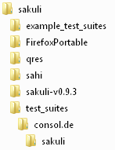    

Within `sakuli`, create a file `sakuli_page.js` and paste the following code skeleton: 

`sakuli_page.js` - *test script file* 

```
_dynamicInclude($includeFolder);
// 60 and 70 are the warn/crit threshold for this case in seconds. 
// make sure to choose a value below the suite threshold in testsuite.properties.
var testCase = new TestCase(60, 70);
var env = new Environment();
var screen = new Region();

try {
  // your code
  env.sleep(1000);
} catch (e) {
    testCase.handleException(e);
} finally {
    testCase.saveResult();
}

```

Within `consol.de`, create the following two files: 

`testsuite.suite` - *instruction for Sakuli which cases have to be executed and their start URL*

``` 
sakuli/sakuli_page.js http://consol.de/sakuli
```

`testsuite.properties` - *settings for this suite*

```
testsuite.id=consol_de_sakuli
testsuite.name=Tests the Sakuli web page

# 100 and 120 are warn/crit thresholds for the whole suite containing all cases. 
# make sure to choose a higher value than the sum of the thresholds of all cases. 
testsuite.warningTime=100
testsuite.criticalTime=120

testsuite.browser=firefox

```

## start the empty test
*Goals: use the Sakuli starter, learn to handle https sites* 

Start the new test (make sure to quote the folder correctly when it contains spaces)

`sakuli run "c:\Program Files (x86)\sakuli\test_suites\consol.de" -browser firefox_portable`

Ups. You will be presented a page like this: 

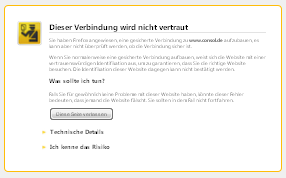 

What happened? Sahi, acting as a proxy, opened the https page, and delivered it to your browser also with https, but this time with a *self signed* server certificate (it cannot sign its certificate with the original root CA... ). Your browser warns you rightly about the fact that you are not connecting directly to consol.de - in fact, you only requested the Sahi proxy. Click on "I understand the risk" and accept the exception. 

To check if there are more certificicates to accept (not all of them you are asked for!), close the browser and the Sahi cmd window. Start the Sahi dashboard from `__INSTALL_DIR__/sahi/userdata/bin/start_dashboard.bat/.sh` and follow the instructions   in [Sahi HTTPS](testdefintion/advanced-topics/sahi-https.md#mozilla-firefox).

## record Sahi steps
*Goals: use the Sahi Controller to identify elements on the page, write Sahi methods* 

Now it's time to let Sahi check some content on the page. 

There are two ways to get Sahi instructions into `sakuli_page.js`: 

- copy & paste from the Sahi Controller
- record by the Sahi Controller, copy & paste from the file 

### copy/paste

Start the test suite again; the Sakuli web page should appear and the test should hold for 1000 seconds (see `env.sleep(1000)`in the script!). The "sleep" statement is a nice trick when writing long tests; wherever you put a 1000s sleep in, the test will execute until this position and wait. Think of it like a breakpoint when debugging a program. 

Open the Sahi Controller (hold the `ALT` key on Windows or `CTRL + ALT` on Linux and doubleclick anywhere on the page) to open this window: 

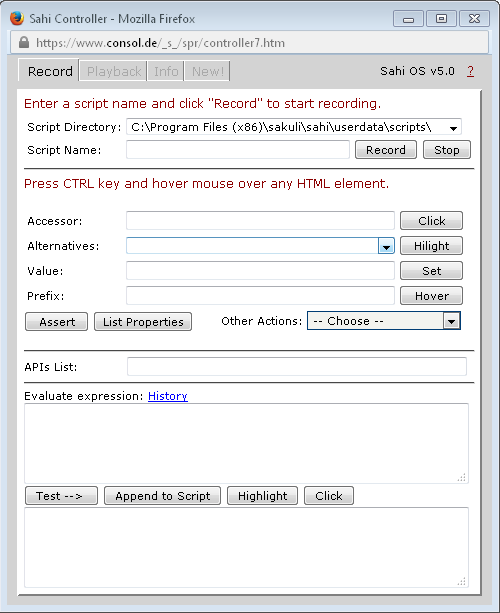

First, we want Sahi to check if there is the Sakuli Logo on the page. Hold the Ctrl key and move the mouse pointer on the Sakuli logo. Watch the Sahi Controller: it detects the HTML elements below the mouse pointer and generates the [accessor method for "image"](http://sahipro.com/docs/sahi-apis/accessor-apis.html#_image) automagically: 

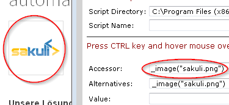

Click on "Assert" to let Sahi autogenerate [assertion methods](http://sahipro.com/docs/sahi-apis/assertions.html): 

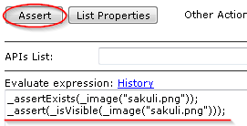

Just copy the second line (which checks the visibility of an element) into the clipboard and paste it into `sakuli_page.js` before the "sleep" statement. 

Furtheron, we want to assure that the contact form of the web page os displayed correctly. Move the mouse pointer down to the "Kontakt" link; Sahi should display the accessor `_image("Kontakt zu ConSol")` (1). This time use the "click" button on the controller (2) to execute a click; this also generates the complete [browser action](http://sahipro.com/docs/sahi-apis/action-apis.html) statement (3) which you can copy/paste also into the test case: 

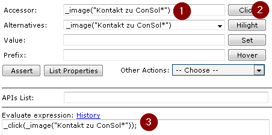  

In the end, Sahi should check that the appeared popup window contains the text "Schreiben Sie uns!". You guessed it - move the mouse pointer over this text and click the "Assert" button again. The fourth assertion is the right one, which we also paste into the test script: 

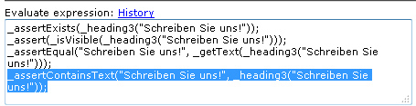  

Now remove the "sleep" statement from the script file; it should look now like that: 

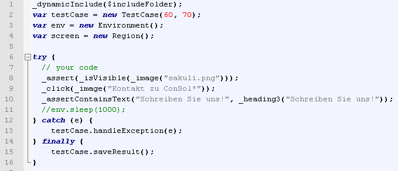

Run the suite again now - it should execute the three Sahi actions without an error. Perhaps you want Sahi to highlight the items it is acting on: just use the `_highlight()` method from the [debug helper API](http://sahipro.com/docs/sahi-apis/debug-helper-apis.html) to mark each element with a red border before accessing it: 

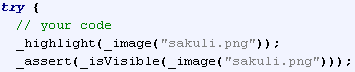

### record

Another method is to record all steps into a file; for this, enter a filename and click on "record": 

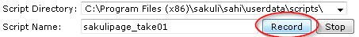

Remark: actions like clicks are written to file automatically. All other actions like assertions can be written to file by clicking the button "Append to Script": 

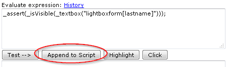

After you have clicked on "stop", open the recorded file, copy everything and paste the lines in to the Sakuli script file. 

## Create GUI aware actions
*Goals: learn to take screenshots for GUI pattern detection and write code to detect Regions on your Screen*

The GUI-Actions described in the [Sakuli-API documentation](testdefintion/sakuli-api.md) are implemented on top of the [Sikuli-API](https://github.com/RaiMan/SikuliX-2014). As example we will add the page as a bookmark and after that remove this bookmark again (do not ask for the sense - it's only a demo). Insert the "sleep"  line again as the very first statement within the "try"-block. Run the test again, it should hold as soon the Sakuli page has loaded. 

Adding a page as a bookmark is (in firefox) to click on the star icon in the menu bar: 

 

Take a screeshot of this menu item which looks similar to this one and save the image as "star.png" in the same folder as the Sakuli script. 

For Sikuli there is no record functionality as in Sahi, so we have to code. But keep your hair on, the syntax is easy and [well documented](https://github.com/ConSol/sakuli/blob/master/docs/sakuli-api.md). Write the "waitForImage" statement right before the sleep line: 

```
try {
  // your code
  screen.waitForImage("star",10).highlight().click();
  env.sleep(1000);
```
This tells Sikuli to search on the whole screen for a region which looks exactly like the screenshot image "star". 
The returned region gets then highlighted and clicked. (For the interested ones: method chaining is possible because `waitForImage` and `highlight` are both returning regions objects as well.)

When you run the test, you will see that Sikuli clicks on the star to bookmark the page. To un-bookmark, we have to click again on the st... - wait, not *this* star we already know. Got the difference? Now the star has changed its color to blue. So we have to take a new screenshot `star_blue.png`:


**CAUTION**: This is a nice example for the little traps to fall in when writing e2e tests. Remember that Sakuli has moved the mouse pointer to the (disabled) star to click it. Due to the fact that the mouse did not leave this position, the blue star will still have a "hover" / "mouseover" state. Set your screenshot editor (e.g. [Greenshot](http://getgreenshot.org/) / [Shutter](http://shutter-project.org/) to a capture delay of ~3s and move the mouse over the star before the picture is taken. You have got the **wrong** image if it looks like this: 


The line to click the blue star is not that hard to guess: 

```
screen.waitForImage("star_blue",10).highlight().click();
```

You will see that there is one more step to do - to un-bookmark, Sikuli has to click on a separate button (this may be labelled in another language on your system): 

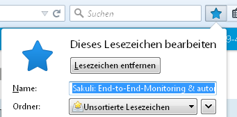

So take a screenshot of (only) the "remove"-Button, save it as `remove.png` and add the third line to the test: 

```
screen.waitForImage("remove",10).click();
```
You might ask why we did not highlight the button first as we did in the steps before. The reason is that the highlight function acts as a separate process in the OS. It becomes the active application (you see this process for about one second in the task bar) and takes over the focus from firefox. The menu to delete a bookmark is volatile and gets hidden again as soon the focus is away. In this case, we have to do without the highlight. 

The complete code looks now: 

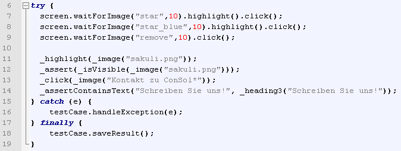

This code isn't very sensful, but it demonstrates how Sakuli makes it possible to use two completely different automation tools in one single test file. We are sure you have better fields of application - **have fun with Sakuli :-)**

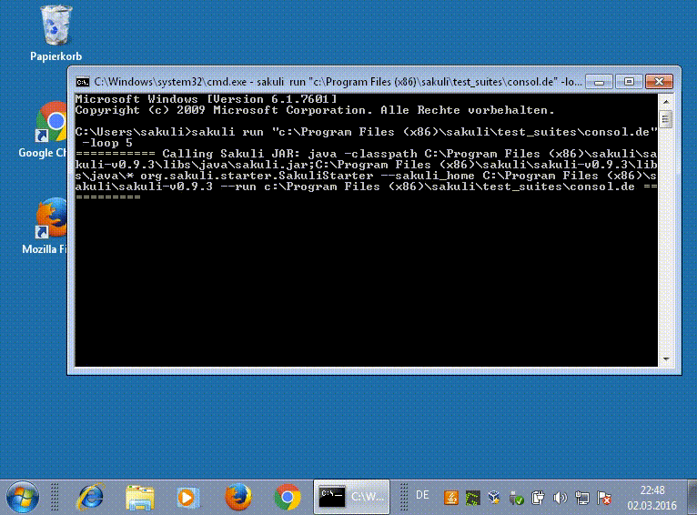