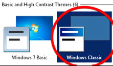

# Troubleshooting Sakuli-Client
## Sahi
### Sahi does not start
_**When I click on the "Start Sahi" icon on the desktop to Start Sahi Dashboard, nothing comes up.**_

#### Check PATH
Open _**%SAKULI_HOME%**\sahi\userdata\bin\start_dashboard.bat_ insert a new line on the end of the script and add "pause". Save te file and try to start Sahi again. If the error message is like *"command 'java' was not found"*, you should check if _**%PATH%**_ is containing the right path to the java executable.   

### No browsers in Dashboard
_**When I open the Sahi dashboard, no browsers are shown.**_

 

Open _**SAKULI_HOME**\sahi\userdata\config\browser_types.xml_. Each browser is defined within a **browserType** block. 
#### Check variable ProgramFiles
"path" probably contains the variable **"$ProgramFiles (x86)…"**, which is wrong. *$ProgramFiles* itself resolves already to the right folder, hence you should delete the " (x86)" part. Restart the Sahi dashboard and try again.
	


## Sakuli
### How to make tests more reliable
These steps are optional, but will improve the check quality/reliability. 

#### Windows 
##### Disable desktop background 
Set the desktop background to a homogenous color. 


##### Disable screen saver and screen locking

Disable everything which can cause the screen to get locked / changed in its appearance.  

##### Change theme and title bar colors
Windows 7 comes by default with an "aero" theme, which is quite awkward for Sakuli, because there are many transparency effects which cause window elements to change their appearance dependend on the elements below. For that, change the theme to "Windows Classic".



Furthermore, change the colors of **active** and **inactive** title bars to **non gradient**: 


##### Enable Window Activation
Windows does not allow per default to bring an application in the foreground. This must be allowed for Sakuli: 

* Start -> "regedit"
* [ HKEY_CURRENT_USER\Control Panel\Desktop ]
* "ForegroundLockTimeout" (DWORD) => "0" (default = 30d40xh)

##### Disable Window Animation
Disable the animation of window minimize/maximize actions: 

* "regedit"
* [HKEY_CURRENT_USER\Control Panel\Desktop\WindowMetrics ]
* "MinAnimate" (String) => "0" 

##### Disable Cleartype
ClearType ("antialiasing" / "Font Smoothing"), is a technology that is used to display computer fonts with clear and with smooth edges. The MS Terminal Services Client (RDP client) enables this feature depending on the available bandwidth, which means that screenshots made within RDP sessions may be taken without ClearType, but during the test execution on the local console, they are compared with the desktop displayed in ClearType. Although we only had problems with RDP and Cleartype, it is a good idea to disable ClearType completely:

* "regedit"
* [ HKEY_CURRENT_USER\Control Panel\Desktop ]
* "FontSmoothingType" (DWORD) => "0" 

##### Disable all visual effects
* Start -> Control Panel -> System -> Advanced
* Performance -> Settings -> Visual Effects -> Custom
* Disable everything: 


##### RDP related settings
The following steps have only to be done if you are accessing the Sakuli Client with RDP. 
###### Disable Clipboard Sharing
The "paste" function of Sakuli uses the clipboard at runtime to decrypt and paste passwords. For this reason, the clipboard exchange of the Sakuli client and the RDP client should be suppressed in the settings tab of your **local Remote Desktop client**:


This can be set globally in the registry **of your local host**: 

* "regedit"
* [ HKEY_CURRENT_USER\Software\Microsoft\Terminal Server Client ]
* "DisableDriveRedirection" (DWORD) => "1" 

##### Disable Firefox' Plugin Container
Plugins Container is a technique of Mozilla Firefox to run browser add-ons in a separate process than firefox.exe. This should ensure that a hanging add-on does not affect the browser process. But sometimes "Plugins Container" itself makes problems. Sakuli (better: Sahi) does not need any browser plugins - so, if you don't, disable Plugin Container: 

* Start -> Control Panel -> System -> Advanced system settings
* Advanced -> Environment Variables -> System variables
	* Variable name: MOZ_DISABLE_OOP_PLUGINS
	* Value: 1
 
###### Disable the "GUI-less" mode
If you minimize the Remote Desktop window (the window that display the remote computer’s desktop), the operating system switches the remote session to a "GUI-less mode" which does not transfer any window data anymore. As a result, Sakuli is unable to interact with the tested application’s GUI, as the whole screen is not visible.

To disable the "GUI-less" mode **on your local host**: 

* "regedit"
* [ HKEY_CURRENT_USER\Software\Microsoft\Terminal Server Client ]
* "RemoteDesktop_SuppressWhenMinimized" (DWORD) => "2"

##### Disable Error reporting service
Error reporting is enabled by default - you should turn off this service because it can display messages (about crashes applications, e.g. when Sakuli kills an application in the end of a test), which remain on the screen until somebody clicks them away. 
* Start -> Control Panel -> System and Security -> Action center
* Change Action Center settings -> Problem reporting settings
* Set "Never check for solutions"  

### cannot resolve mac address

FIXME

 
### Suite does not start
#### Sikuli lib path


FIXME

### Missing keys on `type("...")` or not successful `paste("...")`
It is possible if you use inside of the browser the typing and paste funktion of sakuli, which simulates real keyboard 
interaction, that they sometimes won't work as you expect. The reason for this is, that in the backend running
Sahi proxy communicates with your browser over synchronous POST-requests. If you actually hit such a POST-request timeslot,
it is possible that your Browser engine will lost the key events.

__Solution:__ Set the property `sahi.proxy.requestDelayOnSikuliInput.delayTime` in your `sakuli.properties` or `testsuite.properties` which modify the request interval 
of the sahi proxy so that the keyboard interaction won't be in conflict with some synchronous POST-requests. See:

 ```
 # Specifies the interval in milliseconds, what should be applied when sikuli based input
 # (like typing or clicking) is interacting with a Browser website.
 # This setting only make sense, if your test does NOT use Sahi functions for controlling the
 # testing website. This setting will prevent the test for losing some key or click events
 # in case of blocking, synchronous sahi-interal status requests.
 #
 sahi.proxy.requestDelayOnSikuliInput.delayTime=500
 ```
