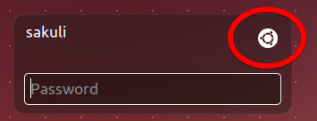
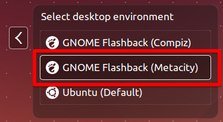
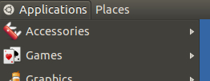
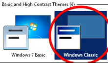
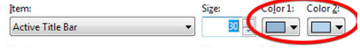
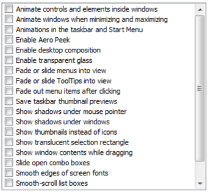
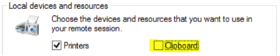

# Troubleshooting and Tuning the Sakuli client

## Desktop tuning
These steps are optional, but will improve the check quality/reliability. 

### Ubuntu 
#### install GNOME session fallback theme
Sakuli can test on Unity, of course - but [gnome-session-fallback](https://apps.ubuntu.com/cat/applications/gnome-session-fallback/) is more than sufficient…  

 `sudo apt-get install gnome-session-fallback`

After the installation, relogin and select the desktop envirionment __GNOME Flashback (Metacity)__:

The Ubuntu menu bar should have changed now to the "classical" one: 

#### Restore gsettings key bindings

In headless checks you will encounter problems using the TAB key as well as "s": 
* The TAB key will switch applications (like Alt+tab)
* "s" will open the applications menu

For some reason (?), gsettings binds "s" and TAB to the Super key by default. Open a terminal as the Sakuli user and execute the following commands to restore that to the default: 

    gsettings set org.gnome.desktop.wm.keybindings switch-applications "['<Alt>Tab']"
    gsettings set org.gnome.desktop.wm.keybindings panel-main-menu "['<Alt>F1']"

### Windows 

#### Change Windows theme and title bar colors
Windows 7 comes by default with an "aero" theme, which is quite awkward for Sikuli, because there are many transparency effects which cause window elements to change their appearance dependend on the elements below. For that, change the theme to "Windows Classic".

Furthermore, change the colors of **active** and **inactive** title bars to **non gradient**: 

#### Enable Window Activation
Windows does not allow per default to bring an application in the foreground. This must be allowed for Sakuli: 

* Start -> "regedit"
* [ HKEY_CURRENT_USER\Control Panel\Desktop ]
* "ForegroundLockTimeout" (DWORD) => "0" (default = 30d40xh)

#### Disable Window Animation
Disable the animation of window minimize/maximize actions: 

* "regedit"
* [HKEY_CURRENT_USER\Control Panel\Desktop\WindowMetrics ]
* "MinAnimate" (String) => "0" 

#### Disable Cleartype
ClearType ("antialiasing" / "Font Smoothing"), is a technology that is used to display computer fonts with clear and with smooth edges. The MS Terminal Services Client (RDP client) enables this feature depending on the available bandwidth, which means that screenshots made within RDP sessions may be taken without ClearType, but during the test execution on the local console, they are compared with the desktop displayed in ClearType. Although we only had problems with RDP and Cleartype, it is a good idea to disable ClearType completely:

* "regedit"
* [ HKEY_CURRENT_USER\Control Panel\Desktop ]
* "FontSmoothingType" (DWORD) => "0" 

#### Disable all visual effects
* Start -> Control Panel -> System -> Advanced
* Performance -> Settings -> Visual Effects -> Custom
* Disable everything: 

#### RDP related settings
The following steps have only to be done if you are accessing the Sakuli Client via RDP. 
##### Disable Clipboard Sharing
The "paste" function of Sakuli uses the clipboard at runtime to decrypt and paste passwords. For this reason, the clipboard exchange of the Sakuli client and the RDP client should be suppressed in the settings tab of your **local Remote Desktop client**:

This can be set globally in the registry **of your local host**: 

* "regedit"
* [ HKEY_CURRENT_USER\Software\Microsoft\Terminal Server Client ]
* "DisableDriveRedirection" (DWORD) => "1" 

#### Disable Firefox' Plugin Container
Plugins Container is a technique of Mozilla Firefox to run browser add-ons in a separate process than firefox.exe. This should ensure that a hanging add-on does not affect the browser process. But sometimes "Plugins Container" itself makes problems. Sakuli (better: Sahi) does not need any browser plugins - so, if you don't, disable Plugin Container: 

* Start -> Control Panel -> System -> Advanced system settings
* Advanced -> Environment Variables -> System variables
	* Variable name: MOZ_DISABLE_OOP_PLUGINS
	* Value: 1
 
##### Disable the "GUI-less" mode
If you minimize the Remote Desktop window (the window that display the remote computer’s desktop), the operating system switches the remote session to a "GUI-less mode" which does not transfer any window data anymore. As a result, Sakuli is unable to interact with the tested application’s GUI, as the whole screen is not visible.

To disable the "GUI-less" mode **on your local host**: 

* "regedit"
* [ HKEY_CURRENT_USER\Software\Microsoft\Terminal Server Client ]
* "RemoteDesktop_SuppressWhenMinimized" (DWORD) => "2"

#### Disable Error reporting service
Error reporting is enabled by default - you should turn off this service because it can display messages (about crashes applications, e.g. when Sakuli kills an application in the end of a test), which remain on the screen until somebody clicks them away. 

* Start -> Control Panel -> System and Security -> Action center
* Change Action Center settings -> Problem reporting settings
* Set "Never check for solutions"  

If you still get messages for crashed applications, try to:

* "regedit"
* [ HKEY_LOCAL_MACHINE\Software\Microsoft\Windows\Windows Error Reporting ]
* "DontShowUI" (DWORD) => "1"

#### Using task scheduler

To execute your testcase regularly you can add new tasks to the windows task scheduler. As action, use this command to put the cmd window into the background to not disturb your tests:

    cmd.exe /c start /min C:\sakuli\sakuli-v0.X.0\bin\sakuli.bat --run "C:\sakuli\example_test_suites\example_windows" ^& exit

## Troubleshooting

### Hanging applications

If you are testing applications which tend to hang/freeze, there is a solution (currently only for Windows) to "tidy up" stale processes on each start of Sakuli. Add this line to `sakuli.bat`:  

    cscript.exe %SAKULI_HOME%\bin\helper\killproc.vbs -f %SAKULI_HOME%\bin\helper\procs_to_kill.txt
    
In `procs_to_kill.txt` you can define which processes should be killed before Sakuli starts a new check: 

    # Full path: 
    C:\Program Files\Mozilla Firefox\firefox.exe
    C:\Program Files\Internet Explorer\iexplore.exe
    # Using wildcards (%): 
    java%sakuli.jar

### Sikuli does not recognize images

If Sikuli does not recognize regions on the screen or does recognize the wrong ones, check the following list of possible reasons: 

* **Run the client's OS on a fixed resolution:** Some applications/OS scale window elements slightly depending on the resolution. for example, if you are running Sakuli within Virtualbox, the guest OS changes its resolution as soon as you resize the VM window. The dimensions of window elements can then slightly diverge by 1-2 pixels from the screenshots taken before. This difference is small for human's eyes, but a big one for Sikuli. Make sure to disable features like "Auto-Adjust Guest Display" and set the Client's desktop to a common resolution (e.g. 1024x768). Side note: the smaller you set the resolution, the less work has to be done by Sikuli. 
* **Disable any image compression algorithms** in your screenshot capturing program (Greenshot, Shutter, …). Otherwise Sikuli will compare *compressed* pattern images with *umcompressed* image data on the screen, which will fail for sure.     
* Sikuli uses a **[similarity](http://doc.sikuli.org/region.html)** value of **0.8 by default**. That value (range: 0-1) determines how many pixels on the screen have to match the pixels of a screenshot file. "0" means "no pixels at all" (not very useful), "1" means "all pixels". So set the similarity, use [setSimilarity](/docs/sakuli-api.md#Environment.setSimilarity) of the Environment class. 
    * If Sikuli recognizes the **wrong region** for a given screenshot, try to **increase the similarity**, e.g. `env.setSimilarity(0.9);`. 
    * If Sikuli does **not recognize** anything, try to slightly **decrease the similarity**, e.g. `env.setSimilarity(0.6)`. This should only be the case when you want Sikuli to "search for somethink *like*…". 
    * **Important note:** we repeatedly noticed that results are best with a similarity of `0.99` instead of `1.0`. 

### Missing keystrokes on `type("...")` or failing `paste("...")`

Sikuli keyboard events (`type()`and `paste()`) on a Sahi-controlled browser instance can get lost if they are executed at the same time when Sahi internal status requests are sent from the browser to the Sahi proxy (default: 10x per sec). 

For this reason, Sikuli type/paste methods first extend the Sahi status interval to the value of `sahi.proxy.onSikuliInput.delayPerKey` (in ms) which is long enough to execute _one_ keyboard action. For the method `type` (which is "press/release character by character""), a multiple if this value is chosen. Before leaving the paste/type method, the interval gets reset by Sakuli to the default Sahi status interval.

This setting is not needed if Sikuli does keyboard actions on GUIs not controlled by Sahi.

### `Application("...").getRegion()` returns `NULL` or an `NullPointerException`
On **Ubuntu** or other **Linux** based OS check if the packe `wmctrl` is installed. If not install it via:
	
	sudo apt-get install wmctrl
	
### GUI test only
 
 To start GUI test only you can use the sahi default domain as start URL 
 `http://sahi.example.com/_s_/dyn/Driver_initialized` in the file `testsuite.suites`
 and as browser phantomJS.